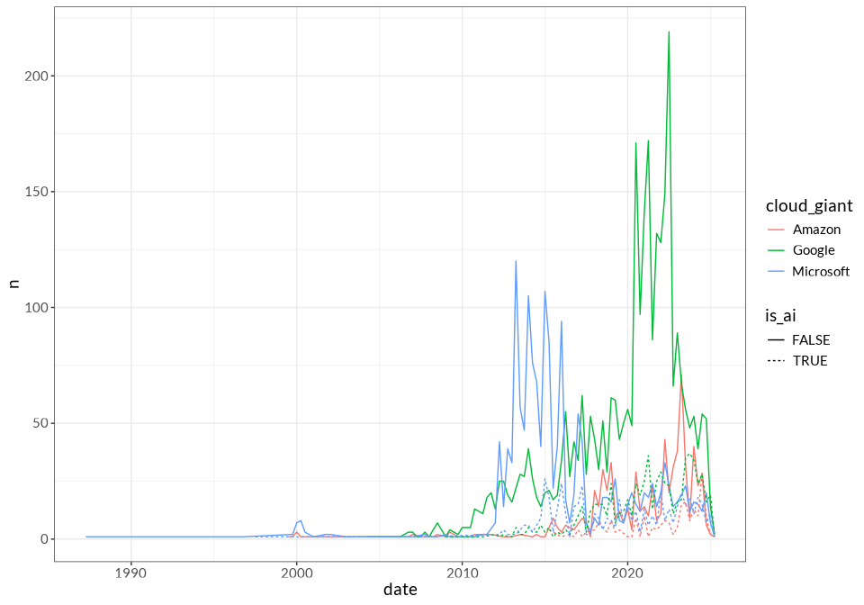
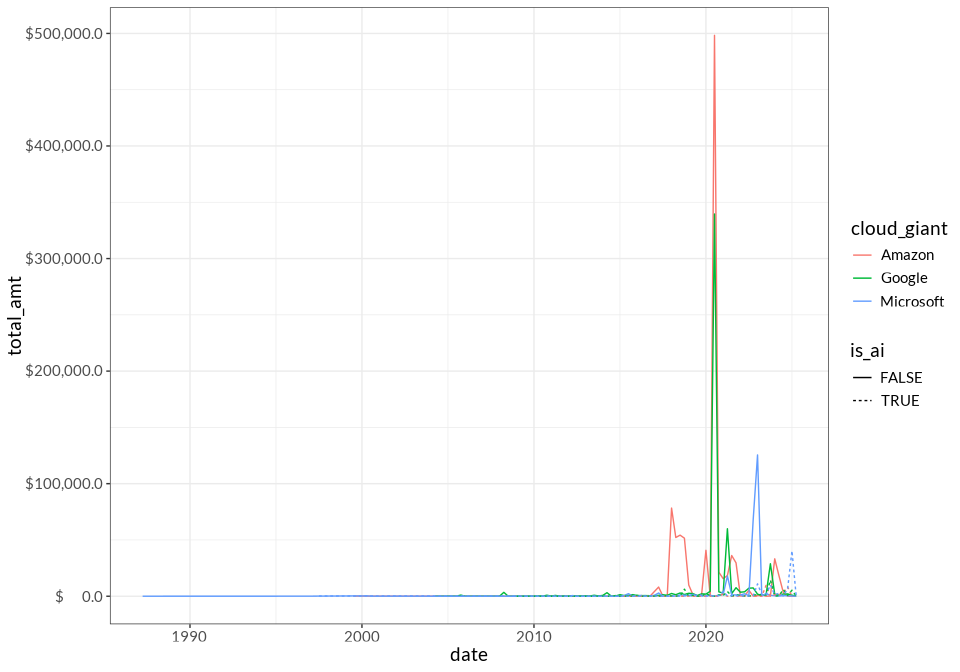

startup investments
================
2025-05-18

- [At a glance](#at-a-glance)
  - [Aliases](#aliases)
  - [Summary stats](#summary-stats)
  - [Largest investments](#largest-investments)
- [Investment partners](#investment-partners)
- [Sectoral analysis](#sectoral-analysis)
  - [When are cloud companies releasing “free” / open source to build
    their
    market?](#when-are-cloud-companies-releasing-free--open-source-to-build-their-market)
  - [AI vs Non-AI](#ai-vs-non-ai)
  - [Cloud vs Non-Cloud](#cloud-vs-non-cloud)
- [Impacts of investment](#impacts-of-investment)
  - [“Ouroboros” of Cloud](#ouroboros-of-cloud)
  - [Dependence of investment receivers on Big
    Cloud](#dependence-of-investment-receivers-on-big-cloud)
  - [Lead/ secondary: Can we quantify/ describe the difference in target
    firm when Big Cloud Lead investor vs secondary
    investor?](#lead-secondary-can-we-quantify-describe-the-difference-in-target-firm-when-big-cloud-lead-investor-vs-secondary-investor)
- [Changes over time](#changes-over-time)
- [Depending on kind of funding round? Can we test if VC deals are diff
  than others? Or if amounts are generally bigger when the Big Three
  invest or
  lead?](#depending-on-kind-of-funding-round-can-we-test-if-vc-deals-are-diff-than-others-or-if-amounts-are-generally-bigger-when-the-big-three-invest-or-lead)
- [International and “Third world”
  development](#international-and-third-world-development)

# At a glance

## Aliases

| Cloud corp | Aliases (# deals) |
|:---|:---|
| Amazon | AWS EdStart (1) , AWS Investments LLC (1) , Amazon Australia (1) , Amazon Housing Equity Fund (1) , Amazon One Medical (1) , Georg Hesse (Ex-Amazon Music) (1) , AWS Fintech Accelerator (2) , Amazon AWS Incubator (2) , Amazon.com NV Investment Holdings (2) , Banco da Amazonia (2) , Amazon Future Engineer (3) , AWS Double Equity (4) , Amazon.com.incs Ltd (4) , Amazon Launchpad (5) , AWS Activate (11) , Amazon Corporate Holdings (11) , Amazon Smbhav Venture Fund (11) , Austria Wirtschaftsservice (AWS) (12) , Amazon Industrial Innovation Fund (14) , Amazon Business (15) , AWS Foundation (17) , AWS Healthcare Accelerator (23) , AWS Startup Loft Accelerator (23) , AWS FinTech Africa Accelerator (25) , AWS Space Accelerator (37) , AWS Impact Accelerator (63) , Amazon Alexa Fund (140) , Amazon Web Services (148) , Amazon (158) |
| Google | Google AI (1) , Google Quantum AI (1) , Google for Startups Israel (1) , Google Canada (2) , Google Umbono (2) , Google’s Africa Investment Fund (2) , Google for Startups Women Founders Fund (7) , NCAIR-Google AI Fund (10) , Google Digital News Initiative (11) , Google for Startups Accelerator Canada (11) , Google Assistant Investments (21) , Google for Startups Latino Founders Fund (24) , Google Cloud (26) , Alphabet (27) , Google.org (85) , Google Launchpad Accelerator (117) , Google (313) , Google Ventures (1178) , Google for Startups (1654) |
| Microsoft | Microsoft Airband (1) , Microsoft Imagine Fund (1) , Microsoft Research (1) , Microsoft Founders Hub (2) , Azure (4) , Microsoft AI for Good Accelerator (13) , Microsoft Accelerator Shanghai (14) , Microsoft Accelerator Berlin (41) , Microsoft Accelerator Seattle (43) , Microsoft Climate Innovation Fund (51) , Microsoft Accelerator London (71) , Microsoft Accelerator Paris (72) , Microsoft ScaleUp Tel Aviv (109) , Microsoft Accelerator Bangalore (125) , Microsoft for Startups (126) , Microsoft (302) , M12 - Microsoft’s Venture Fund (317) , Microsoft Accelerator (387) |

## Summary stats

| Statistic                                 |   Value |
|:------------------------------------------|--------:|
| \# of investments                         | 1174990 |
| \# of unique funding rounds               |  711238 |
| \# of investors                           |  300934 |
| \# of companies receiving investment      | 3862971 |
| Median investors in a given funding round |       1 |

Top-level summary statistics of full dataset

The table below is a bit messy conceptually because it’s processing the
same funding round multiple times often.

| Statistic | Amazon | Google | Microsoft | All investments |
|:---|:---|:---|:---|:---|
| Total number of deals | 738.0 | 3,493.0 | 1,680.0 | 1,174,990.0 |
| Total dollar amount of participated deals (in millions, including other investors) | 491,058.6 | 553,237.6 | 311,571.8 | 628,176,583.1 |
| Number of investing aliases | 29.0 | 19.0 | 18.0 | 155,581.0 |
| % of time that they “lead” funding rounds | 68.4 | 69.4 | 54.3 | 29.0 |
| % of time that they are the sole investor | 53.8 | 58.0 | 57.4 | 28.6 |
| Median size of participating deal | 2.2 | 7.0 | 12.0 | 6.0 |
| Companies receiving investment | 633.0 | 2,854.0 | 1,260.0 | 294,632.0 |

Summary statistics by cloud corp

## Largest investments

These are outliers, generally –

| name | investor_name | announced_on | raised_amount |
|:---|:---|:---|---:|
| Google investment in Corporate Round - Reliance Jio | Google | 2020-07-15 | 3.3737e+11 |
| Microsoft investment in Post-IPO Debt - MTN Nigeria | Microsoft | 2023-03-08 | 1.2500e+11 |
| Amazon investment in Corporate Round - Amazon Seller Services | Amazon | 2020-09-30 | 1.1225e+11 |
| Amazon Corporate Holdings investment in Corporate Round - Amazon Seller Services | Amazon Corporate Holdings | 2020-09-30 | 1.1225e+11 |
| Microsoft investment in Venture Round - Wemade | Microsoft | 2022-11-02 | 6.6000e+10 |
| Google investment in Corporate Round - Kakao Mobility | Google | 2021-04-01 | 5.6510e+10 |
| Microsoft investment in Venture Round - OpenAI | Microsoft | 2025-03-31 | 4.0000e+10 |
| Amazon investment in Corporate Round - Amazon Seller Services | Amazon | 2018-08-14 | 2.7000e+10 |
| Amazon investment in Corporate Round - Amazon Seller Services | Amazon | 2018-05-01 | 2.6000e+10 |
| Google Ventures investment in Venture Round - Cafe24 | Google Ventures | 2023-12-05 | 2.6000e+10 |

# Investment partners

Who are the cloud companies most often partnering with?

For first pass, plucked out top 20 co-investors for each of the big
three. Table below has 43 rows because of the overlaps. Honestly not
that informative or shocking –

- coinvestors are pretty spread out, there are some repeated partners
  but big three mostly invest by themselves and not with a single
  investment partner
- And they share *some* partners but not a ton – maybe that can be
  exploited to show theyre investing in different things
- Google invests sometimes with MSFT and Amazon, but not a whole lot?

| name                        | Amazon     | Google     | Microsoft  |
|:----------------------------|:-----------|:-----------|:-----------|
| Techstars                   | 31 (2.97%) |            | 50 (2.75%) |
| Harvard Innovation Labs     | 18 (1.73%) |            |            |
| Schultz Family Foundation   | 18 (1.73%) |            |            |
| Lightspeed Venture Partners | 17 (1.63%) | 41 (1.11%) | 21 (1.15%) |
| Accel                       | 12 (1.15%) | 68 (1.84%) | 12 (0.66%) |
| Google                      | 9 (0.86%)  |            | 17 (0.93%) |
| T. Rowe Price               | 9 (0.86%)  |            |            |
| Google Ventures             | 8 (0.77%)  |            | 12 (0.66%) |
| Felicis                     | 8 (0.77%)  |            |            |
| Lux Capital                 | 8 (0.77%)  | 36 (0.97%) |            |
| Spark Capital               | 7 (0.67%)  |            |            |
| General Catalyst            | 7 (0.67%)  | 53 (1.43%) | 12 (0.66%) |
| New Enterprise Associates   | 7 (0.67%)  | 57 (1.54%) | 12 (0.66%) |
| Mixpanel                    | 7 (0.67%)  |            |            |
| Segment                     | 7 (0.67%)  |            |            |
| Relay Ventures              | 7 (0.67%)  |            |            |
| True Ventures               | 7 (0.67%)  |            |            |
| Intel Capital               | 7 (0.67%)  |            | 24 (1.32%) |
| Fidelity                    | 7 (0.67%)  | 37 (1%)    |            |
| Microsoft                   | 7 (0.67%)  |            |            |
| Kleiner Perkins             |            | 111 (3%)   | 15 (0.82%) |
| Andreessen Horowitz         |            | 94 (2.54%) | 14 (0.77%) |
| SV Angel                    |            | 67 (1.81%) |            |
| Sequoia Capital             |            | 58 (1.57%) |            |
| Casdin Capital              |            | 49 (1.32%) |            |
| ARCH Venture Partners       |            | 49 (1.32%) |            |
| First Round Capital         |            | 43 (1.16%) |            |
| Khosla Ventures             |            | 42 (1.13%) |            |
| Polaris Partners            |            | 41 (1.11%) |            |
| Greylock                    |            | 41 (1.11%) |            |
| Y Combinator                |            | 39 (1.05%) | 11 (0.6%)  |
| Menlo Ventures              |            | 37 (1%)    |            |
| Index Ventures              |            | 36 (0.97%) |            |
| 500 Global                  |            | 33 (0.89%) |            |
| Social Tech Trust           |            |            | 26 (1.43%) |
| Salesforce Ventures         |            |            | 23 (1.26%) |
| Notable Capital             |            |            | 16 (0.88%) |
| Mayfield Fund               |            |            | 15 (0.82%) |
| NVIDIA                      |            |            | 14 (0.77%) |
| Cisco Investments           |            |            | 13 (0.71%) |
| Battery Ventures            |            |            | 13 (0.71%) |
| Alumni Ventures             |            |            | 12 (0.66%) |
| Gaingels                    |            |            | 11 (0.6%)  |

<!-- -->

# Sectoral analysis

## When are cloud companies releasing “free” / open source to build their market?

## AI vs Non-AI

By \# of deals:

<!-- -->

<!-- -->

<!-- --> \##
GovTech

What kind of govtech firms to Big Cloud invest in?

## Cloud vs Non-Cloud

Compare cloud companies investment strategies to “non-cloud” tech, eg
Meta/Apple, or edge, eg Intel

# Impacts of investment

## “Ouroboros” of Cloud

When is Big Cloud are investing in other companies that do cloud infra
(Kubernetes)?

## Dependence of investment receivers on Big Cloud

Can we measure when one Big Cloud co has invested a large amount of
company’s investment total?

(how can we operationalize this given the dataset? Similar to
lead/secondary question?)

## Lead/ secondary: Can we quantify/ describe the difference in target firm when Big Cloud Lead investor vs secondary investor?

# Changes over time

When does Amazon become a cloud company? What about the others? Is there
some “natural” progression? What external data will we need?

# Depending on kind of funding round? Can we test if VC deals are diff than others? Or if amounts are generally bigger when the Big Three invest or lead?

# International and “Third world” development

Would probably be code to incorporate an “all EU” designation if we can
get an easy list of the country codes. Each company receiving investment
is listed once per cloud giant in the table below, so if Google invested
in Asian Company LLC 3 times it’d still only appear once.

| country_code                   | Amazon       | Google        | Microsoft    |
|:-------------------------------|:-------------|:--------------|:-------------|
| USA                            | 350 (55.29%) | 1326 (46.46%) | 513 (40.71%) |
| IND                            | 68 (10.74%)  | 167 (5.85%)   | 126 (10%)    |
| GBR                            | 38 (6%)      | 180 (6.31%)   | 141 (11.19%) |
| ISR                            | 19 (3%)      | NA            | 124 (9.84%)  |
| AUS                            | 16 (2.53%)   | NA            | NA           |
| CAN                            | 16 (2.53%)   | 52 (1.82%)    | 36 (2.86%)   |
| AUT                            | 15 (2.37%)   | NA            | NA           |
| BRA                            | 14 (2.21%)   | 263 (9.22%)   | NA           |
| NGA                            | 12 (1.9%)    | 83 (2.91%)    | NA           |
| NA                             | 10 (1.58%)   | NA            | 19 (1.51%)   |
| All others for this cloud corp | 96 (15.17%)  | 497 (17.41%)  | 165 (13.1%)  |
| ESP                            | NA           | 82 (2.87%)    | NA           |
| DEU                            | NA           | 78 (2.73%)    | 51 (4.05%)   |
| JPN                            | NA           | 71 (2.49%)    | NA           |
| POL                            | NA           | 62 (2.17%)    | NA           |
| KOR                            | NA           | 52 (1.82%)    | NA           |
| CHN                            | NA           | NA            | 157 (12.46%) |
| FRA                            | NA           | NA            | 84 (6.67%)   |
| SGP                            | NA           | NA            | 13 (1.03%)   |

Summary statistics by cloud corp

There seems to be Third World development / investment arms maintained
by the big 3 cloud:

- <https://www.crunchbase.com/organization/umbono>
- Google’s Africa Investment Fund investment in Series C - Moniepoin
- NCAIR-Google AI Fund: Nigeria investments
- Alibaba?
