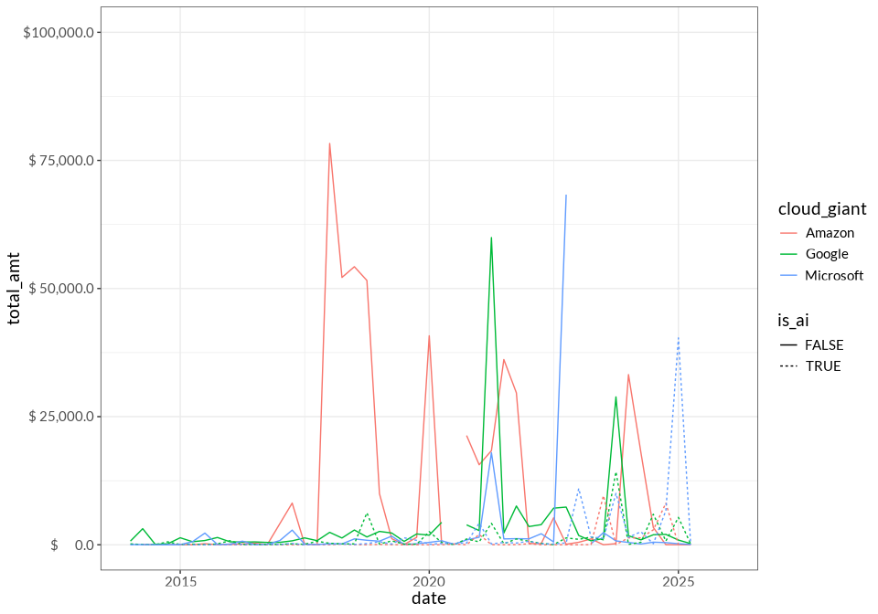

startup investments
================
2025-05-18

- [At a glance](#at-a-glance)
  - [Aliases](#aliases)
  - [Summary stats](#summary-stats)
  - [Largest investments](#largest-investments)
- [Co-investment](#co-investment)
  - [Investment partners](#investment-partners)
  - [When does the Big Cloud invest in the same
    companies?](#when-does-the-big-cloud-invest-in-the-same-companies)
- [Sectoral analysis](#sectoral-analysis)
  - [Sectors at a glance](#sectors-at-a-glance)
  - [Popular sectors over time](#popular-sectors-over-time)
  - [AI vs Non-AI](#ai-vs-non-ai)
  - [Cloud vs Non-Cloud](#cloud-vs-non-cloud)
- [Impacts of investment](#impacts-of-investment)
  - [“Ouroboros” of Cloud](#ouroboros-of-cloud)
  - [Dependence of investment receivers on Big
    Cloud](#dependence-of-investment-receivers-on-big-cloud)
  - [Lead/ secondary: Can we quantify/ describe the difference in target
    firm when Big Cloud Lead investor vs secondary
    investor?](#lead-secondary-can-we-quantify-describe-the-difference-in-target-firm-when-big-cloud-lead-investor-vs-secondary-investor)
- [Changes over time](#changes-over-time)
- [Depending on kind of funding round? Can we test if VC deals are diff
  than others? Or if amounts are generally bigger when the Big Three
  invest or
  lead?](#depending-on-kind-of-funding-round-can-we-test-if-vc-deals-are-diff-than-others-or-if-amounts-are-generally-bigger-when-the-big-three-invest-or-lead)
- [International and “Third world”
  development](#international-and-third-world-development)

# At a glance

## Aliases

| Cloud corp | Aliases (# deals) |
|:---|:---|
| Amazon | AWS EdStart (1) , AWS Investments LLC (1) , Amazon Australia (1) , Amazon Housing Equity Fund (1) , Amazon One Medical (1) , Georg Hesse (Ex-Amazon Music) (1) , AWS Fintech Accelerator (2) , Amazon AWS Incubator (2) , Amazon.com NV Investment Holdings (2) , Banco da Amazonia (2) , Amazon Future Engineer (3) , AWS Double Equity (4) , Amazon.com.incs Ltd (4) , Amazon Launchpad (5) , AWS Activate (11) , Amazon Corporate Holdings (11) , Amazon Smbhav Venture Fund (11) , Austria Wirtschaftsservice (AWS) (12) , Amazon Industrial Innovation Fund (14) , Amazon Business (15) , AWS Foundation (17) , AWS Healthcare Accelerator (23) , AWS Startup Loft Accelerator (23) , AWS FinTech Africa Accelerator (25) , AWS Space Accelerator (37) , AWS Impact Accelerator (63) , Amazon Alexa Fund (140) , Amazon Web Services (148) , Amazon (158) |
| Google | Google AI (1) , Google Quantum AI (1) , Google for Startups Israel (1) , Google Canada (2) , Google Umbono (2) , Google’s Africa Investment Fund (2) , Google for Startups Women Founders Fund (7) , NCAIR-Google AI Fund (10) , Google Digital News Initiative (11) , Google for Startups Accelerator Canada (11) , Google Assistant Investments (21) , Google for Startups Latino Founders Fund (24) , Google Cloud (26) , Alphabet (27) , Google.org (85) , Google Launchpad Accelerator (117) , Google (313) , Google Ventures (1178) , Google for Startups (1654) |
| Microsoft | Microsoft Airband (1) , Microsoft Imagine Fund (1) , Microsoft Research (1) , Microsoft Founders Hub (2) , Azure (4) , Microsoft AI for Good Accelerator (13) , Microsoft Accelerator Shanghai (14) , Microsoft Accelerator Berlin (41) , Microsoft Accelerator Seattle (43) , Microsoft Climate Innovation Fund (51) , Microsoft Accelerator London (71) , Microsoft Accelerator Paris (72) , Microsoft ScaleUp Tel Aviv (109) , Microsoft Accelerator Bangalore (125) , Microsoft for Startups (126) , Microsoft (302) , M12 - Microsoft’s Venture Fund (317) , Microsoft Accelerator (387) |

## Summary stats

| Statistic                                 |   Value |
|:------------------------------------------|--------:|
| \# of investments                         | 1174990 |
| \# of unique funding rounds               |  711238 |
| \# of investors                           |  300934 |
| \# of companies receiving investment      | 3862971 |
| Median investors in a given funding round |       1 |

Top-level summary statistics of full dataset

The table below is a bit messy conceptually because it’s processing the
same funding round multiple times often.

| Statistic | Amazon | Google | Microsoft | All investments |
|:---|:---|:---|:---|:---|
| Total number of deals | 738.0 | 3,493.0 | 1,680.0 | 1,174,990.0 |
| Total dollar amount of participated deals (in millions, including other investors) | 33,075.2 | 114,936.9 | 98,160.2 | 30,289,750.8 |
| Number of investing aliases | 29.0 | 19.0 | 18.0 | 155,581.0 |
| % of time that they “lead” funding rounds | 68.4 | 69.4 | 54.3 | 29.0 |
| % of time that they are the sole investor | 53.8 | 58.0 | 57.4 | 28.6 |
| Median size of participating deal | 2.3 | 6.5 | 11.0 | 4.8 |
| Companies receiving investment | 633.0 | 2,854.0 | 1,260.0 | 294,632.0 |

Summary statistics by cloud corp

## Largest investments

These are outliers, generally –

| name | announced_on | Raised amount, millions |
|:---|:---|:---|
| Microsoft investment in Venture Round - OpenAI | 2025-03-31 | 40,000 |
| Microsoft investment in Corporate Round - OpenAI | 2023-01-10 | 10,000 |
| Microsoft investment in Venture Round - OpenAI | 2024-10-02 | 6,600 |
| Alphabet investment in Series C - Waymo | 2024-07-23 | 5,600 |
| Google investment in Corporate Round - Reliance Jio | 2020-07-15 | 4,489.24 |
| Amazon investment in Convertible Note - Anthropic | 2023-09-25 | 4,000 |
| Amazon investment in Corporate Round - Anthropic | 2024-11-22 | 4,000 |
| Google investment in Post-IPO Equity - Clearwire | 2008-05-06 | 3,200 |
| Amazon investment in Series E - Rivian | 2020-07-10 | 2,500 |
| Alphabet investment in Series B - Waymo | 2021-06-16 | 2,500 |
| Alphabet investment in Series A - Waymo | 2020-03-02 | 2,250 |
| Microsoft investment in Corporate Round - Cruise | 2021-01-19 | 2,000 |
| Microsoft investment in Post-IPO Secondary - London Stock Exchange Group | 2022-12-11 | 2,000 |
| Google investment in Corporate Round - Anthropic | 2023-10-27 | 2,000 |
| Google investment in Series B - Commonwealth Fusion | 2021-12-01 | 1,800 |
| Amazon investment in Corporate Round - Amazon Seller Services | 2020-09-30 | 1,526.48 |
| Amazon Corporate Holdings investment in Corporate Round - Amazon Seller Services | 2020-09-30 | 1,526.48 |
| Google investment in Series E - Gojek | 2018-02-12 | 1,500 |
| Google investment in Post-IPO Equity - ADT | 2022-09-06 | 1,500 |
| Microsoft investment in Corporate Round - G42 | 2024-04-15 | 1,500 |

# Co-investment

## Investment partners

Who are the cloud companies most often partnering with?

For first pass, plucked out top 20 co-investors for each of the big
three. Table below has 43 rows because of the overlaps. Honestly not
that informative or shocking –

- coinvestors are pretty spread out, there are some repeated partners
  but big three mostly invest by themselves and not with a single
  investment partner
- And they share *some* partners but not a ton – maybe that can be
  exploited to show theyre investing in different things
- Google invests sometimes with MSFT and Amazon, but not a whole lot?

| name                        | Amazon     | Google     | Microsoft  |
|:----------------------------|:-----------|:-----------|:-----------|
| Techstars                   | 31 (2.97%) |            | 50 (2.75%) |
| Harvard Innovation Labs     | 18 (1.73%) |            |            |
| Schultz Family Foundation   | 18 (1.73%) |            |            |
| Lightspeed Venture Partners | 17 (1.63%) | 41 (1.11%) | 21 (1.15%) |
| Accel                       | 12 (1.15%) | 68 (1.84%) | 12 (0.66%) |
| Google                      | 9 (0.86%)  |            | 17 (0.93%) |
| T. Rowe Price               | 9 (0.86%)  |            |            |
| Google Ventures             | 8 (0.77%)  |            | 12 (0.66%) |
| Felicis                     | 8 (0.77%)  |            |            |
| Lux Capital                 | 8 (0.77%)  | 36 (0.97%) |            |
| Spark Capital               | 7 (0.67%)  |            |            |
| General Catalyst            | 7 (0.67%)  | 53 (1.43%) | 12 (0.66%) |
| New Enterprise Associates   | 7 (0.67%)  | 57 (1.54%) | 12 (0.66%) |
| Mixpanel                    | 7 (0.67%)  |            |            |
| Segment                     | 7 (0.67%)  |            |            |
| Relay Ventures              | 7 (0.67%)  |            |            |
| True Ventures               | 7 (0.67%)  |            |            |
| Intel Capital               | 7 (0.67%)  |            | 24 (1.32%) |
| Fidelity                    | 7 (0.67%)  | 37 (1%)    |            |
| Microsoft                   | 7 (0.67%)  |            |            |
| Kleiner Perkins             |            | 111 (3%)   | 15 (0.82%) |
| Andreessen Horowitz         |            | 94 (2.54%) | 14 (0.77%) |
| SV Angel                    |            | 67 (1.81%) |            |
| Sequoia Capital             |            | 58 (1.57%) |            |
| Casdin Capital              |            | 49 (1.32%) |            |
| ARCH Venture Partners       |            | 49 (1.32%) |            |
| First Round Capital         |            | 43 (1.16%) |            |
| Khosla Ventures             |            | 42 (1.13%) |            |
| Polaris Partners            |            | 41 (1.11%) |            |
| Greylock                    |            | 41 (1.11%) |            |
| Y Combinator                |            | 39 (1.05%) | 11 (0.6%)  |
| Menlo Ventures              |            | 37 (1%)    |            |
| Index Ventures              |            | 36 (0.97%) |            |
| 500 Global                  |            | 33 (0.89%) |            |
| Social Tech Trust           |            |            | 26 (1.43%) |
| Salesforce Ventures         |            |            | 23 (1.26%) |
| Notable Capital             |            |            | 16 (0.88%) |
| Mayfield Fund               |            |            | 15 (0.82%) |
| NVIDIA                      |            |            | 14 (0.77%) |
| Cisco Investments           |            |            | 13 (0.71%) |
| Battery Ventures            |            |            | 13 (0.71%) |
| Alumni Ventures             |            |            | 12 (0.66%) |
| Gaingels                    |            |            | 11 (0.6%)  |

<!-- -->

## When does the Big Cloud invest in the same companies?

| org_name | name | announced_on | investor_names | raised_amount_usd | category_groups_list | category_list |
|:---|:---|:---|:---|---:|:---|:---|
| DNAnexus | Series B - DNAnexus | 2011-10-12 | First Round Capital, Uncork Capital, TPG Biotech, Google Ventures, Felicis, K9 Ventures | 15000000 | Biotechnology,Data and Analytics,Health Care,Internet Services,Science and Engineering,Software | Bioinformatics,Biotechnology,Cloud Computing,Medical,Software |
| DNAnexus | Series C - DNAnexus | 2014-01-03 | Google Ventures, TPG Biotech, Claremont Creek Ventures, First Round Capital | 15000000 | Biotechnology,Data and Analytics,Health Care,Internet Services,Science and Engineering,Software | Bioinformatics,Biotechnology,Cloud Computing,Medical,Software |
| DNAnexus | Series E - DNAnexus | 2018-01-02 | TPG Biotech, Foresite Capital, Google Ventures, MidCap Financial, Claremont Creek Ventures, Microsoft, Genuity Science | 58000000 | Biotechnology,Data and Analytics,Health Care,Internet Services,Science and Engineering,Software | Bioinformatics,Biotechnology,Cloud Computing,Medical,Software |
| DNAnexus | Series F - DNAnexus | 2019-02-06 | Innovatus Capital Partners, Foresite Capital, Genuity Science, Claremont Creek Ventures, Google Ventures, TPG Biotech | 68000000 | Biotechnology,Data and Analytics,Health Care,Internet Services,Science and Engineering,Software | Bioinformatics,Biotechnology,Cloud Computing,Medical,Software |
| DNAnexus | Series G - DNAnexus | 2020-06-09 | Perceptive Advisors, Google Ventures, Foresite Capital, Northpond Ventures, First Round Capital, TPG Biotech, Regeneron | 100000000 | Biotechnology,Data and Analytics,Health Care,Internet Services,Science and Engineering,Software | Bioinformatics,Biotechnology,Cloud Computing,Medical,Software |
| DNAnexus | Series H - DNAnexus | 2022-03-08 | Blackstone Accelerates Growth, Northpond Ventures, Foresite Capital, Perceptive Advisors, Google Ventures, Innovatus Capital Partners | 200000000 | Biotechnology,Data and Analytics,Health Care,Internet Services,Science and Engineering,Software | Bioinformatics,Biotechnology,Cloud Computing,Medical,Software |
| DocuSign | Series D - DocuSign | 2012-08-07 | Kleiner Perkins, Accel, Google Ventures, Sapphire Ventures, Comcast Ventures, Rose Park Advisors | 55700000 | Consumer Electronics,Hardware,Information Technology,Internet Services,Privacy and Security,Software | Business Process Automation (BPA),Cloud Management,Computer,E-Signature,Information Technology,SaaS,Software |
| DocuSign | Series E - DocuSign | 2014-03-04 | Google Ventures, Comcast Ventures, Scale Venture Partners, Ignition Partners, Accel, Sapphire Ventures, Frazier Technology Ventures, Kleiner Perkins, Sands Capital Ventures, Cross Creek, Titanium Ventures, Salesforce Ventures, Jackson Square Ventures | 85000000 | Consumer Electronics,Hardware,Information Technology,Internet Services,Privacy and Security,Software | Business Process Automation (BPA),Cloud Management,Computer,E-Signature,Information Technology,SaaS,Software |
| DocuSign | Series F - DocuSign | 2015-05-12 | Brookside Capital, Generation Investment Management, ClearBridge Investments, ICONIQ Growth, Wasatch Advisors, Wellington Management, Sands Capital Ventures, Founders Circle Capital, Bain Capital Ventures, Ron Suber, Microsoft, Green Bay Ventures, Dell Technologies Capital, Alta Park Capital, Bryan Rosenblatt, Intel Capital, Deutsche Telekom | 300000000 | Consumer Electronics,Hardware,Information Technology,Internet Services,Privacy and Security,Software | Business Process Automation (BPA),Cloud Management,Computer,E-Signature,Information Technology,SaaS,Software |
| Uber | Series C - Uber | 2013-08-23 | TPG Growth, Google Ventures, Scott Belsky, Shawn Carter, John Kobs | 363000000 | Apps,Mobile,Software,Transportation | Logistics,Mobile Apps,Ride Sharing,Software,Transportation |
| Uber | Series D - Uber | 2014-06-06 | Fidelity, Wellington Management, BlackRock, Summit Partners, Kleiner Perkins, Google Ventures, Menlo Ventures, ACME Capital, General Atlantic, Shervin Pishevar, American Express Ventures, Hedosophia | 1400000000 | Apps,Mobile,Software,Transportation | Logistics,Mobile Apps,Ride Sharing,Software,Transportation |
| Uber | Series F - Uber | 2015-07-31 | Microsoft, Bennett Coleman and Co Ltd, MSA Capital, AppWorks, 408 Ventures, All Blue Capital, Eastlink Capital | 1000000000 | Apps,Mobile,Software,Transportation | Logistics,Mobile Apps,Ride Sharing,Software,Transportation |
| Comfy | Seed Round - Comfy | 2013-06-01 | Formation 8, Claremont Creek Ventures, Google Ventures, Navitas Capital, Red Swan Ventures, Travis Putnam, Jeff Hammerbacher, Dave Eisenberg, Techammer | 1140000 | Apps,Artificial Intelligence (AI),Data and Analytics,Mobile,Real Estate,Science and Engineering,Software | Artificial Intelligence (AI),Business Intelligence,Enterprise Software,Mobile Apps,SaaS,Smart Building |
| Comfy | Series B - Comfy | 2016-06-08 | Emergence Capital, CBRE Group, M12 - Microsoft’s Venture Fund | 12000000 | Apps,Artificial Intelligence (AI),Data and Analytics,Mobile,Real Estate,Science and Engineering,Software | Artificial Intelligence (AI),Business Intelligence,Enterprise Software,Mobile Apps,SaaS,Smart Building |
| Ionic Security | Series A - Ionic Security | 2012-07-27 | Sig Mosley, ff Venture Capital, Google Ventures, Kleiner Perkins, Terawatt Ventures, BLH Venture Partners, Farallon Research, Social Investors, TechSquare Labs | 2040000 | Information Technology,Privacy and Security,Professional Services | Cyber Security,Information Technology,Intellectual Property,Security |
| Ionic Security | Series B - Ionic Security | 2014-02-20 | Icon Ventures, Google Ventures, Kleiner Perkins, ff Venture Capital, Phillip Dunkelberger, Kenneth Levine, TechOperators, Webb Investment Network, BLH Venture Partners, Paul Judge, Social Investors, Mike Bergelson | 25500000 | Information Technology,Privacy and Security,Professional Services | Cyber Security,Information Technology,Intellectual Property,Security |
| Ionic Security | Series C - Ionic Security | 2015-01-12 | Meritech Capital Partners, Kleiner Perkins, Google Ventures, TechOperators, Icon Ventures | 40100000 | Information Technology,Privacy and Security,Professional Services | Cyber Security,Information Technology,Intellectual Property,Security |
| Ionic Security | Series D - Ionic Security | 2016-06-01 | Amazon, Goldman Sachs, Hayman Capital, Google Ventures, Icon Ventures, Kleiner Perkins, Meritech Capital Partners, TechOperators | 45000000 | Information Technology,Privacy and Security,Professional Services | Cyber Security,Information Technology,Intellectual Property,Security |
| Ionic Security | Series E - Ionic Security | 2019-02-27 | Ten Eleven Ventures, TechOperators, Google Ventures, Icon Ventures, Google, Kleiner Perkins, JP Morgan Chase, Meritech Capital Partners, Goldman Sachs | 40000000 | Information Technology,Privacy and Security,Professional Services | Cyber Security,Information Technology,Intellectual Property,Security |
| Orange Chef | Seed Round - Orange Chef | 2014-02-07 | Social Capital, Forerunner, Lerer Hippeau, Tekton Ventures, Kima Ventures, BDMI, SparkLabs Global Ventures, Google Ventures, New Enterprise Associates, Rockpoint Capital, Graph Ventures, James Tankenoff, John Schmitt, Jason Krikorian, Kai Huang, BoxGroup, Melo7 Tech Partners, Great Oaks Venture Capital, Vitamix Corporation, Shaun Arora, Innovating Capital | 4900000 | Artificial Intelligence (AI),Consumer Electronics,Data and Analytics,Hardware,Manufacturing,Science and Engineering,Software | Artificial Intelligence (AI),Consumer Electronics,Hardware,Manufacturing,Software |
| Orange Chef | Venture Round - Orange Chef | 2015-06-25 | Amazon Alexa Fund | NA | Artificial Intelligence (AI),Consumer Electronics,Data and Analytics,Hardware,Manufacturing,Science and Engineering,Software | Artificial Intelligence (AI),Consumer Electronics,Hardware,Manufacturing,Software |
| Synack | Series A - Synack | 2014-04-24 | Kleiner Perkins, Google Ventures, Greylock, AllegisCyber, Derek Smith | 7500000 | Artificial Intelligence (AI),Data and Analytics,Information Technology,Privacy and Security,Science and Engineering,Software | Artificial Intelligence (AI),Cyber Security,Network Security,Security |
| Synack | Series B - Synack | 2015-02-19 | Notable Capital, Icon Ventures, Kleiner Perkins, Greylock, Google Ventures | 25000000 | Artificial Intelligence (AI),Data and Analytics,Information Technology,Privacy and Security,Science and Engineering,Software | Artificial Intelligence (AI),Cyber Security,Network Security,Security |
| Synack | Series C - Synack | 2017-04-11 | M12 - Microsoft’s Venture Fund, Hewlett Packard Enterprise, Singtel Innov8, Notable Capital, Google Ventures, Kleiner Perkins, Icon Ventures, Greylock, AllegisCyber, Intel Capital, Section Partners | 21250000 | Artificial Intelligence (AI),Data and Analytics,Information Technology,Privacy and Security,Science and Engineering,Software | Artificial Intelligence (AI),Cyber Security,Network Security,Security |
| Synack | Series D - Synack | 2020-05-28 | Google Ventures, M12 - Microsoft’s Venture Fund, Singtel Innov8, Kleiner Perkins, Notable Capital, B Capital, Icon Ventures, C5 Capital, Intel Capital, Hewlett Packard Enterprise, Derek Smith, The Syndicate Group | 52000000 | Artificial Intelligence (AI),Data and Analytics,Information Technology,Privacy and Security,Science and Engineering,Software | Artificial Intelligence (AI),Cyber Security,Network Security,Security |
| Framed Data | Seed Round - Framed Data | 2014-12-11 | Google Ventures, Jotter Ventures, NYU Innovation Venture Fund, Alexis Ohanian, Charlie Pinto, Garry Tan, Kevin Mahaffey, Klau von Sayn-Wittgenstein, Paul Buchheit, Sean Byrnes, Sumon Sadhu, Initialized Capital, Sinovation Ventures | 2000000 | Artificial Intelligence (AI),Data and Analytics,Information Technology,Software | Analytics,Data Mining,Machine Learning,Predictive Analytics |
| Framed Data | Non Equity Assistance - Framed Data | 2016-06-01 | Microsoft Accelerator Seattle | NA | Artificial Intelligence (AI),Data and Analytics,Information Technology,Software | Analytics,Data Mining,Machine Learning,Predictive Analytics |
| Percolata | Seed Round - Percolata | 2015-01-12 | Google Ventures, Andreessen Horowitz, Menlo Ventures, Foundation Capital, Rubicon Venture Capital, WI Harper Group, Cherubic Ventures, Comet Labs | 5000000 | Commerce and Shopping,Hardware,Software | Hardware,Retail,Retail Technology,Software |
| Percolata | Non Equity Assistance - Percolata | 2016-02-02 | Microsoft Accelerator Seattle | NA | Commerce and Shopping,Hardware,Software | Hardware,Retail,Retail Technology,Software |
| Percolata | Convertible Note - Percolata | 2013-08-03 | Techammer, Social Starts, Garage Technology Ventures, Amasia, Andreessen Horowitz, Google Ventures, Menlo Ventures, Foundation Capital, Jeff Hammerbacher, RTA Capital, Susa Ventures | NA | Commerce and Shopping,Hardware,Software | Hardware,Retail,Retail Technology,Software |
| Percolata | Venture Round - Percolata | 2016-03-15 | Andreessen Horowitz, Foundation Capital, Google Ventures, Jeff Hammerbacher, Menlo Ventures, Diamond TechVentures, Spring Creek Investment Management, Amasia | NA | Commerce and Shopping,Hardware,Software | Hardware,Retail,Retail Technology,Software |
| Cloudflare | Series D - Cloudflare | 2015-09-22 | CapitalG, Microsoft Accelerator, Qualcomm Ventures, Baidu, Fidelity, New Enterprise Associates, Pelion Venture Partners, Union Square Ventures, Venrock, Greenspring Associates, Google | 110000000 | Data and Analytics,Internet Services,Privacy and Security,Software | Analytics,Enterprise Software,Security,Web Hosting |
| Impossible Foods | Series C - Impossible Foods | 2014-06-27 | Horizons Ventures, Google Ventures, Serena Ventures, Khosla Ventures | 40000000 | Food and Beverage,Health Care | Food and Beverage,Food Processing,Nutrition,Organic Food,Plant-Based Foods |
| Impossible Foods | Series E - Impossible Foods | 2019-05-01 | VERSO Capital, William Adams, Open Philanthropy, Ruby Rose Langenheim, Horizons Ventures, Kirk Cousins, Temasek Holdings, Sailing Capital, Trevor Noah, Paul George, Next Play Capital, Kal Penn, K2 Global, Khosla Ventures, Shane Neman, Google Ventures, Philip Rosenthal, Ahmir Khalib Thompson, Microsoft, Julien Machot, Shawn Carter, Michael Arrieta, Jay Brown, Anton Zaslavski, Viking Global Investors, Bill Gates, Serena Ventures, Katy Perry, Manhattan Venture Partners (MVP), Jaden Smith, UBS, Bracket Capital, Alexis Ohanian, Ethos Family Office, SMR3T Capital LLC, General Global Capital, Asas Capital, Pario Ventures, Vika Ventures, Raj Luhar, G Squared | 300000000 | Food and Beverage,Health Care | Food and Beverage,Food Processing,Nutrition,Organic Food,Plant-Based Foods |
| Impossible Foods | Series F - Impossible Foods | 2020-03-16 | Anton Zaslavski, Mirae Asset, Trevor Noah, Shawn Carter, Temasek Holdings, Khosla Ventures, Kal Penn, Mindy Kaling, Alexis Ohanian, Jaden Smith, Katy Perry, William Adams, Serena Williams, Horizons Ventures, Bill Gates, Kirk Cousins, Philip Rosenthal, Ruby Rose Langenheim, Paul George, Ahmir Khalib Thompson, London Impact Ventures, Viking Global Investors, Google Ventures | 500000000 | Food and Beverage,Health Care | Food and Beverage,Food Processing,Nutrition,Organic Food,Plant-Based Foods |
| Weaveworks | Series B - Weaveworks | 2016-05-11 | Google Ventures, Accel, Redline Capital | 20000000 | Information Technology,Internet Services,Software | Cloud Computing,Developer Tools,DevOps,Enterprise Software,Software |
| Weaveworks | Series C - Weaveworks | 2020-12-08 | Bright Pixel (formerly Sonae IM), Accel, Redline Capital, Google Ventures, Amazon Web Services, Ericsson Ventures, Orange Ventures | 36649991 | Information Technology,Internet Services,Software | Cloud Computing,Developer Tools,DevOps,Enterprise Software,Software |
| Luma | Series A - Luma | 2016-04-07 | Accel, Felicis, Base Ventures, BIP Capital, Relay Ventures, Webb Investment Network, Centerview Capital, Knoll Ventures, Specialized Types, Amazon Alexa Fund | 12500000 | Hardware,Information Technology,Internet Services,Privacy and Security | Cyber Security,Hardware,Internet,Network Security |
| Luma | Series A - Luma | 2016-09-14 | Andreessen Horowitz, Google Ventures | 7000000 | Hardware,Information Technology,Internet Services,Privacy and Security | Cyber Security,Hardware,Internet,Network Security |
| Coralogix | Non Equity Assistance - Coralogix | 2016-03-13 | Microsoft ScaleUp Tel Aviv | NA | Artificial Intelligence (AI),Data and Analytics,Science and Engineering,Software | Analytics,Artificial Intelligence (AI),Machine Learning,SaaS |
| Coralogix | Non Equity Assistance - Coralogix | 2022-01-01 | Google for Startups | NA | Artificial Intelligence (AI),Data and Analytics,Science and Engineering,Software | Analytics,Artificial Intelligence (AI),Machine Learning,SaaS |
| Coralogix | Non Equity Assistance - Coralogix | 2021-10-25 | Google for Startups | NA | Artificial Intelligence (AI),Data and Analytics,Science and Engineering,Software | Analytics,Artificial Intelligence (AI),Machine Learning,SaaS |
| Defined.ai | Non Equity Assistance - Defined.ai | 2016-02-02 | Microsoft Accelerator Seattle | 200000 | Artificial Intelligence (AI),Commerce and Shopping,Data and Analytics,Hardware,Information Technology,Science and Engineering,Software | Artificial Intelligence (AI),Data Center,Machine Learning,Marketplace,Natural Language Processing,Software |
| Defined.ai | Seed Round - Defined.ai | 2016-09-01 | Amazon Alexa Fund, Portugal Ventures, Sony Innovation Fund, SWAN Venture Fund, Bynd Venture Capital | 1100000 | Artificial Intelligence (AI),Commerce and Shopping,Data and Analytics,Hardware,Information Technology,Science and Engineering,Software | Artificial Intelligence (AI),Data Center,Machine Learning,Marketplace,Natural Language Processing,Software |
| Defined.ai | Series A - Defined.ai | 2018-07-31 | Evolution Equity Partners, Mastercard, Kibo Ventures, Sony, Portugal Ventures, Amazon Alexa Fund, Bynd Venture Capital, Ataria, EDP Ventures | 11800000 | Artificial Intelligence (AI),Commerce and Shopping,Data and Analytics,Hardware,Information Technology,Science and Engineering,Software | Artificial Intelligence (AI),Data Center,Machine Learning,Marketplace,Natural Language Processing,Software |
| BabyChakra | Non Equity Assistance - BabyChakra | 2016-02-22 | Microsoft Accelerator Bangalore, Artha Group | NA | Commerce and Shopping,Community and Lifestyle,Health Care,Information Technology,Internet Services | Child Care,Communities,E-Commerce,Information Technology,Internet |
| BabyChakra | Non Equity Assistance - BabyChakra | 2017-11-29 | Google Launchpad Accelerator | 50000 | Commerce and Shopping,Community and Lifestyle,Health Care,Information Technology,Internet Services | Child Care,Communities,E-Commerce,Information Technology,Internet |
| Fast Forward | Seed Round - Fast Forward | 2016-06-30 | Omidyar Network, Google.org, AT&T, BlackRock | 1250000 | Education,Information Technology | Education,Information Technology,Management Information Systems |
| Fast Forward | Venture Round - Fast Forward | 2017-06-30 | AT&T, BlackRock, The Nasiri Foundation, Twilio, NBCUniversal, Hewlett Packard Enterprise, Google.org, Rita Allen Foundation, Zendesk, Omidyar Network | 2200000 | Education,Information Technology | Education,Information Technology,Management Information Systems |
| Fast Forward | Corporate Round - Fast Forward | 2019-07-02 | PagerDuty, GitHub, Google.org, Twilio.org, BlackRock, Hewlett Packard Enterprise, AWS Foundation | 5000000 | Education,Information Technology | Education,Information Technology,Management Information Systems |
| Code.org | Grant - Code.org | 2016-04-26 | Microsoft, Infosys, Google, Mark Zuckerberg, Priscilla Chan | 23000000 | Education,Other,Science and Engineering,Social Impact,Software | Chemical Engineering,EdTech,Education,Non Profit,STEM Education |
| Tact.ai | Series B - Tact.ai | 2016-12-12 | Upfront Ventures, M12 - Microsoft’s Venture Fund, Accel, Redpoint | 15000000 | Artificial Intelligence (AI),Biotechnology,Data and Analytics,Health Care,Information Technology,Mobile,Sales and Marketing,Science and Engineering,Software | Artificial Intelligence (AI),CRM,Health Care,Life Science,Mobile,SaaS,Sales Automation,Software |
| Tact.ai | Series C - Tact.ai | 2018-06-25 | Comcast Ventures, Salesforce Ventures, Redpoint, Accel, Upfront Ventures, M12 - Microsoft’s Venture Fund, Amazon Alexa Fund | 27000000 | Artificial Intelligence (AI),Biotechnology,Data and Analytics,Health Care,Information Technology,Mobile,Sales and Marketing,Science and Engineering,Software | Artificial Intelligence (AI),CRM,Health Care,Life Science,Mobile,SaaS,Sales Automation,Software |
| Tact.ai | Venture Round - Tact.ai | 2020-01-27 | Honeywell Ventures, M12 - Microsoft’s Venture Fund | NA | Artificial Intelligence (AI),Biotechnology,Data and Analytics,Health Care,Information Technology,Mobile,Sales and Marketing,Science and Engineering,Software | Artificial Intelligence (AI),CRM,Health Care,Life Science,Mobile,SaaS,Sales Automation,Software |
| Tact.ai | Venture Round - Tact.ai | 2021-09-20 | M12 - Microsoft’s Venture Fund, Salesforce Ventures | NA | Artificial Intelligence (AI),Biotechnology,Data and Analytics,Health Care,Information Technology,Mobile,Sales and Marketing,Science and Engineering,Software | Artificial Intelligence (AI),CRM,Health Care,Life Science,Mobile,SaaS,Sales Automation,Software |
| Incorta | Series A - Incorta | 2017-03-01 | Google Ventures, Ron Wohl | 10000000 | Data and Analytics,Design,Information Technology,Internet Services,Software | Analytics,Business Intelligence,Cloud Data Services,Data Integration,Data Visualization |
| Incorta | Series B - Incorta | 2017-09-18 | Kleiner Perkins, Google Ventures, Ron Wohl | 15000000 | Data and Analytics,Design,Information Technology,Internet Services,Software | Analytics,Business Intelligence,Cloud Data Services,Data Integration,Data Visualization |
| Incorta | Series B - Incorta | 2018-10-18 | M12 - Microsoft’s Venture Fund, Titanium Ventures | 15000000 | Data and Analytics,Design,Information Technology,Internet Services,Software | Analytics,Business Intelligence,Cloud Data Services,Data Integration,Data Visualization |
| Incorta | Series C - Incorta | 2019-08-15 | Titanium Ventures, M12 - Microsoft’s Venture Fund, Sorenson Capital, Google Ventures, Kleiner Perkins, Wipro Ventures | 30000000 | Data and Analytics,Design,Information Technology,Internet Services,Software | Analytics,Business Intelligence,Cloud Data Services,Data Integration,Data Visualization |
| Incorta | Series D - Incorta | 2021-06-23 | Google Ventures, Prysm Capital, Titanium Ventures, National Grid, Sorenson Capital, Ron Wohl, Kleiner Perkins, M12 - Microsoft’s Venture Fund, Silicon Valley Bank, Wipro Ventures | 120000000 | Data and Analytics,Design,Information Technology,Internet Services,Software | Analytics,Business Intelligence,Cloud Data Services,Data Integration,Data Visualization |
| Flipkart | Series J - Flipkart | 2017-04-10 | Tencent, Microsoft, eBay | 1400000000 | Commerce and Shopping,Internet Services | E-Commerce,Internet,Marketplace,Shopping |
| Flipkart | Corporate Round - Flipkart | 2023-12-22 | Walmart, Google | 950000000 | Commerce and Shopping,Internet Services | E-Commerce,Internet,Marketplace,Shopping |
| Agolo | Seed Round - Agolo | 2017-05-03 | M12 - Microsoft’s Venture Fund, CRV, Point72 Ventures, AAF Management Ltd., (ERA) Entrepreneurs Roundtable Accelerator | 3500000 | Apps,Artificial Intelligence (AI),Content and Publishing,Data and Analytics,Information Technology,Media and Entertainment,Other,Software,Transportation | Apps,Information Technology,Machine Learning,Natural Language Processing,News,Product Management,Software,Supply Chain Management,Technical Support |
| Agolo | Venture Round - Agolo | 2019-07-25 | Tensility Venture Partners, Microsoft, Google, AAF Management Ltd., M12 - Microsoft’s Venture Fund | NA | Apps,Artificial Intelligence (AI),Content and Publishing,Data and Analytics,Information Technology,Media and Entertainment,Other,Software,Transportation | Apps,Information Technology,Machine Learning,Natural Language Processing,News,Product Management,Software,Supply Chain Management,Technical Support |
| Agolo | Seed Round - Agolo | 2020-02-28 | Alumni Ventures, Tensility Venture Partners, Touchdown Ventures, M12 - Microsoft’s Venture Fund, Ridgeline, Google Assistant Investments | NA | Apps,Artificial Intelligence (AI),Content and Publishing,Data and Analytics,Information Technology,Media and Entertainment,Other,Software,Transportation | Apps,Information Technology,Machine Learning,Natural Language Processing,News,Product Management,Software,Supply Chain Management,Technical Support |
| Agolo | Series A - Agolo | 2022-03-16 | Tensility Venture Partners, Lytical Ventures, Ridgeline, M12 - Microsoft’s Venture Fund, Thomson Reuters, Google Ventures | NA | Apps,Artificial Intelligence (AI),Content and Publishing,Data and Analytics,Information Technology,Media and Entertainment,Other,Software,Transportation | Apps,Information Technology,Machine Learning,Natural Language Processing,News,Product Management,Software,Supply Chain Management,Technical Support |
| Werpx | Grant - Werpx | 2017-01-30 | Amazon Web Services | 21167 | Administrative Services,Artificial Intelligence (AI),Commerce and Shopping,Data and Analytics,Food and Beverage,Other,Science and Engineering,Software,Transportation | Artificial Intelligence (AI),Big Data,Consumer,Delivery,Grocery,Predictive Analytics,Retail,Software,Supply Chain Management |
| Werpx | Grant - Werpx | 2019-03-01 | Google | 19999 | Administrative Services,Artificial Intelligence (AI),Commerce and Shopping,Data and Analytics,Food and Beverage,Other,Science and Engineering,Software,Transportation | Artificial Intelligence (AI),Big Data,Consumer,Delivery,Grocery,Predictive Analytics,Retail,Software,Supply Chain Management |
| Lavelle Networks | Seed Round - Lavelle Networks | 2017-03-10 | Ideaspring Capital, Microsoft Accelerator Bangalore | 600000 | Hardware,Information Technology,Internet Services,Privacy and Security,Software | Cloud Computing,Enterprise Software,Network Hardware,Network Security,SaaS,Software |
| Lavelle Networks | Non Equity Assistance - Lavelle Networks | 2022-01-11 | Google for Startups | NA | Hardware,Information Technology,Internet Services,Privacy and Security,Software | Cloud Computing,Enterprise Software,Network Hardware,Network Security,SaaS,Software |
| Firefly Learning | Non Equity Assistance - Firefly Learning | 2017-01-26 | Microsoft Accelerator London, Upscale | NA | Education,Information Technology,Sales and Marketing,Software | CRM,E-Learning,EdTech,Education,SaaS,Software |
| Firefly Learning | Non Equity Assistance - Firefly Learning | 2021-02-01 | Google for Startups | NA | Education,Information Technology,Sales and Marketing,Software | CRM,E-Learning,EdTech,Education,SaaS,Software |
| True AI | Grant - True AI | 2017-01-14 | Microsoft Accelerator London, Downing Ventures, London Co-Investment Fund, Lifeline Ventures, EASME | 561000 | Artificial Intelligence (AI),Data and Analytics,Other,Professional Services,Science and Engineering,Software | Artificial Intelligence (AI),Customer Service |
| True AI | Non Equity Assistance - True AI | 2017-10-01 | Google for Startups | NA | Artificial Intelligence (AI),Data and Analytics,Other,Professional Services,Science and Engineering,Software | Artificial Intelligence (AI),Customer Service |
| True AI | Non Equity Assistance - True AI | 2017-01-01 | Google for Startups | NA | Artificial Intelligence (AI),Data and Analytics,Other,Professional Services,Science and Engineering,Software | Artificial Intelligence (AI),Customer Service |
| VIVID Technologies | Non Equity Assistance - VIVID Technologies | 2014-04-30 | Microsoft Accelerator London | NA | Hardware,Information Technology,Media and Entertainment,Music and Audio,Other,Professional Services,Science and Engineering,Software | Audio,Customer Service,Information Services,Information Technology,Robotics,Software |
| VIVID Technologies | Non Equity Assistance - VIVID Technologies | 2017-11-29 | Google Launchpad Accelerator | 50000 | Hardware,Information Technology,Media and Entertainment,Music and Audio,Other,Professional Services,Science and Engineering,Software | Audio,Customer Service,Information Services,Information Technology,Robotics,Software |
| IonQ | Series A - IonQ | 2017-07-26 | New Enterprise Associates, Google Ventures, OUP (Osage University Partners), Conconi Growth Partners | 20000000 | Consumer Electronics,Hardware,Information Technology,Science and Engineering | Computer,Electronics,Information Services,Information Technology,Quantum Computing |
| IonQ | Series B - IonQ | 2019-10-22 | Samsung Catalyst Fund, Airbus Ventures, A&E Investments, Hewlett Packard Pathfinder, OUP (Osage University Partners), ACME Capital, Amazon, Tao Capital Partners, New Enterprise Associates, Correlation Ventures, Google Ventures, Bosch Ventures | 55000000 | Consumer Electronics,Hardware,Information Technology,Science and Engineering | Computer,Electronics,Information Services,Information Technology,Quantum Computing |
| IonQ | Post-IPO Equity - IonQ | 2021-10-01 | Time Ventures, Hyundai Motor Company, Mubadala Capital Ventures, MSD Partners, Fidelity, Breakthrough Energy Ventures, Google Ventures, Silver Lake, New Enterprise Associates, Kia Motors | 350000000 | Consumer Electronics,Hardware,Information Technology,Science and Engineering | Computer,Electronics,Information Services,Information Technology,Quantum Computing |
| Eversports | Debt Financing - Eversports | 2017-08-09 | Point Nine, Gerbig Ventures, RTA.vc, Marcin Kurek, AWS Double Equity | 2587946 | Events,Internet Services,Media and Entertainment,Sales and Marketing,Sports | Local,Reservations,Search Engine,Sports |
| Eversports | Non Equity Assistance - Eversports | 2021-03-30 | Google for Startups | NA | Events,Internet Services,Media and Entertainment,Sales and Marketing,Sports | Local,Reservations,Search Engine,Sports |
| Veo Robotics | Venture Round - Veo Robotics | 2017-10-18 | Next47, Lux Capital, Google Ventures | 12000000 | Artificial Intelligence (AI),Data and Analytics,Hardware,Manufacturing,Science and Engineering,Software | Artificial Intelligence (AI),Industrial Automation,Manufacturing,Robotics |
| Veo Robotics | Series A - Veo Robotics | 2019-02-25 | Baidu Ventures, Nikon-SBI Innovation Fund, Lux Capital, Next47, Google Ventures | 15000000 | Artificial Intelligence (AI),Data and Analytics,Hardware,Manufacturing,Science and Engineering,Software | Artificial Intelligence (AI),Industrial Automation,Manufacturing,Robotics |
| Veo Robotics | Series B - Veo Robotics | 2023-04-25 | Yamaha Motor Ventures, Safar Partners, Amazon Industrial Innovation Fund | 14000000 | Artificial Intelligence (AI),Data and Analytics,Hardware,Manufacturing,Science and Engineering,Software | Artificial Intelligence (AI),Industrial Automation,Manufacturing,Robotics |
| Unbabel | Series B - Unbabel | 2018-01-11 | Samsung NEXT, M12 - Microsoft’s Venture Fund, Caixa Capital, Salesforce Ventures, Scale Venture Partners, FundersClub, Notion Capital, Faber | 23000000 | Artificial Intelligence (AI),Data and Analytics,Other,Professional Services,Science and Engineering,Software | Artificial Intelligence (AI),B2B,Machine Learning,Natural Language Processing,Software,Translation Service |
| Unbabel | Series C - Unbabel | 2019-09-23 | Point72 Ventures, M12 - Microsoft’s Venture Fund, Samsung NEXT, Indico Capital Partners, Caixa Capital, Structure Capital, FundersClub, Notion Capital, Scale Venture Partners, Headline, Faber, Greycroft | 60000000 | Artificial Intelligence (AI),Data and Analytics,Other,Professional Services,Science and Engineering,Software | Artificial Intelligence (AI),B2B,Machine Learning,Natural Language Processing,Software,Translation Service |
| Unbabel | Seed Round - Unbabel | 2014-07-18 | Kevin Rose, Elad Gil, Raymond Tonsing, Young Guo, Amino Capital, Shilling, Ryan Petersen, David Peterson, Digital Garage, FundersClub, Klau von Sayn-Wittgenstein, Matrix, Faber, Rob Emrich, Caixa Capital, Adeyemi Ajao, Augusta Investments, Google Ventures, DG VENTURES | 1500000 | Artificial Intelligence (AI),Data and Analytics,Other,Professional Services,Science and Engineering,Software | Artificial Intelligence (AI),B2B,Machine Learning,Natural Language Processing,Software,Translation Service |
| Pulse Labs - The Best Insights Have a Pulse | Convertible Note - Pulse Labs - The Best Insights Have a Pulse | 2017-07-21 | Techstars, Amazon Alexa Fund | 100000 | Artificial Intelligence (AI),Consumer Electronics,Data and Analytics,Design,Real Estate,Science and Engineering,Software,Transportation | Analytics,Application Performance Management,Artificial Intelligence (AI),Automotive,Product Research,Smart Building,Smart Home,Software,Usability Testing,UX Design |
| Pulse Labs - The Best Insights Have a Pulse | Seed Round - Pulse Labs - The Best Insights Have a Pulse | 2018-05-02 | Techstars, Madrona, Bezos Expeditions, Amazon Alexa Fund, Google Assistant Investments | 2500000 | Artificial Intelligence (AI),Consumer Electronics,Data and Analytics,Design,Real Estate,Science and Engineering,Software,Transportation | Analytics,Application Performance Management,Artificial Intelligence (AI),Automotive,Product Research,Smart Building,Smart Home,Software,Usability Testing,UX Design |
| Voicea | Series A - Voicea | 2018-03-07 | Workday Ventures, Notable Capital, Greycroft, Headline, Microsoft, Cisco Investments, Salesforce Ventures, Battery Ventures, Google Ventures, Caffeinated Capital, M12 - Microsoft’s Venture Fund | 14500000 | Artificial Intelligence (AI),Data and Analytics,Other,Science and Engineering,Software | Artificial Intelligence (AI),Collaboration,Machine Learning,Virtual Assistant |
| Voicea | Convertible Note - Voicea | 2019-03-28 | Mindset Ventures, Notable Capital, Salesforce Ventures, Battery Ventures, M12 - Microsoft’s Venture Fund, Cisco Investments, Google Ventures, Headline | NA | Artificial Intelligence (AI),Data and Analytics,Other,Science and Engineering,Software | Artificial Intelligence (AI),Collaboration,Machine Learning,Virtual Assistant |
| Energsoft | Grant - Energsoft | 2017-02-23 | Amazon | 100000 | Artificial Intelligence (AI),Data and Analytics,Design,Energy,Information Technology,Other,Science and Engineering,Software,Sustainability | Analytics,Artificial Intelligence (AI),B2B,Big Data,Data Visualization,Energy Efficiency,Energy Management,Machine Learning,Predictive Analytics,SaaS |
| Energsoft | Pre Seed Round - Energsoft | 2021-01-01 | Microsoft for Startups, Slava Agafonov | 150000 | Artificial Intelligence (AI),Data and Analytics,Design,Energy,Information Technology,Other,Science and Engineering,Software,Sustainability | Analytics,Artificial Intelligence (AI),B2B,Big Data,Data Visualization,Energy Efficiency,Energy Management,Machine Learning,Predictive Analytics,SaaS |
| CTRL-labs | Series B - CTRL-labs | 2018-05-29 | Breyer Capital, Founders Fund, Fuel Capital, Lux Capital, Amazon Alexa Fund, Google Ventures, Vulcan Capital, Spark Capital, Matrix | 28000000 | Artificial Intelligence (AI),Biotechnology,Data and Analytics,Design,Science and Engineering,Software | Artificial Intelligence (AI),Human Computer Interaction,Neuroscience |
| CTRL-labs | Venture Round - CTRL-labs | 2019-02-22 | Breyer Capital, Amazon Alexa Fund, Fuel Capital, Spark Capital, Matrix, Lux Capital, Google Ventures | 28000000 | Artificial Intelligence (AI),Biotechnology,Data and Analytics,Design,Science and Engineering,Software | Artificial Intelligence (AI),Human Computer Interaction,Neuroscience |
| Wikimedia Endowment | Grant - Wikimedia Endowment | 2018-09-25 | Amazon | 1000000 | Other,Social Impact | Association,Non Profit |
| Wikimedia Endowment | Grant - Wikimedia Endowment | 2019-01-22 | Google.org | 2000000 | Other,Social Impact | Association,Non Profit |
| Aiva Health | Venture Round - Aiva Health | 2018-09-27 | Amazon Alexa Fund, Google | NA | Apps,Health Care,Mobile,Other,Software | Enterprise,Health Care,Mobile Apps,Virtual Assistant |
| Loggi | Series C - Loggi | 2017-02-18 | IFC Venture Capital Group, Microsoft, M12 - Microsoft’s Venture Fund, International Finance Corporation | 15000000 | Internet Services,Transportation | Delivery Service,Internet,Logistics,Supply Chain Management |
| Loggi | Non Equity Assistance - Loggi | 2017-11-29 | Google | 1000 | Internet Services,Transportation | Delivery Service,Internet,Logistics,Supply Chain Management |
| Loggi | Series E - Loggi | 2019-06-05 | Fifth Wall, SoftBank, Microsoft, Notable Capital, Velt Partners, M12 - Microsoft’s Venture Fund | 150000000 | Internet Services,Transportation | Delivery Service,Internet,Logistics,Supply Chain Management |
| Loggi | Series F - Loggi | 2021-03-01 | monashees, SoftBank, Microsoft, Notable Capital, Sunley House Capital Management, CapSur Capital, Verde Asset Management, M12 - Microsoft’s Venture Fund, 1289 Capital | 212000000 | Internet Services,Transportation | Delivery Service,Internet,Logistics,Supply Chain Management |
| Loggi | Series D - Loggi | 2018-10-16 | Kaszek, SoftBank Vision Fund, M12 - Microsoft’s Venture Fund | 111000000 | Internet Services,Transportation | Delivery Service,Internet,Logistics,Supply Chain Management |
| Syntiant | Series B - Syntiant | 2018-10-01 | Bosch Ventures, Applied Ventures, Intel Capital, Amazon Alexa Fund, M12 - Microsoft’s Venture Fund, Motorola Solutions Venture Capital, Microsoft, Seraph Group, Sunstone Management, Embark Ventures | NA | Artificial Intelligence (AI),Data and Analytics,Hardware,Science and Engineering,Software | Artificial Intelligence (AI),Machine Learning,Semiconductor,Sensor |
| Syntiant | Series C - Syntiant | 2020-08-04 | M12 - Microsoft’s Venture Fund, Applied Ventures, Atlantic Bridge, Alpha Edison, Miramar Digital Ventures, Embark Ventures, Sunstone Management, Microsoft, Seraph Group | 35000000 | Artificial Intelligence (AI),Data and Analytics,Hardware,Science and Engineering,Software | Artificial Intelligence (AI),Machine Learning,Semiconductor,Sensor |
| Syntiant | Series D - Syntiant | 2022-03-28 | Mirae Asset Capital, Millennium Technology Value Partners, Renesas Electronics Corporation, M12 - Microsoft’s Venture Fund, Atlantic Bridge, Applied Ventures, Bosch Ventures, Amazon Alexa Fund, Intel Capital, Alumni Ventures, Sunstone Management | 56372257 | Artificial Intelligence (AI),Data and Analytics,Hardware,Science and Engineering,Software | Artificial Intelligence (AI),Machine Learning,Semiconductor,Sensor |
| L2P LIMITED | Grant - L2P LIMITED | 2018-03-26 | Microsoft | 120000 | Artificial Intelligence (AI),Data and Analytics,Education,Gaming,Sales and Marketing,Science and Engineering,Software,Sports | Artificial Intelligence (AI),E-Learning,eSports,Machine Learning,Marketing,MMO Games,Online Games |
| L2P LIMITED | Grant - L2P LIMITED | 2019-03-10 | Google Cloud | 100000 | Artificial Intelligence (AI),Data and Analytics,Education,Gaming,Sales and Marketing,Science and Engineering,Software,Sports | Artificial Intelligence (AI),E-Learning,eSports,Machine Learning,Marketing,MMO Games,Online Games |
| Databricks | Series E - Databricks | 2019-02-05 | Microsoft, Coatue, Andreessen Horowitz, Green Bay Ventures, New Enterprise Associates, Battery Ventures, Founders Future, Geodesic Capital, Unbound, BAM Elevate | 250000000 | Artificial Intelligence (AI),Data and Analytics,Information Technology,Science and Engineering,Software | Analytics,Artificial Intelligence (AI),Information Technology,Machine Learning |
| Databricks | Series F - Databricks | 2019-10-22 | Andreessen Horowitz, Tiger Global Management, T. Rowe Price, Coatue, New Enterprise Associates, Green Bay Ventures, Alkeon Capital, Geodesic Capital, BlackRock, Microsoft, Dragoneer Investment Group | 400000000 | Artificial Intelligence (AI),Data and Analytics,Information Technology,Science and Engineering,Software | Analytics,Artificial Intelligence (AI),Information Technology,Machine Learning |
| Databricks | Series G - Databricks | 2021-02-01 | Microsoft, BlackRock, Coatue, Fidelity, Whale Rock Capital Management, CapitalG, Franklin Templeton, Andreessen Horowitz, Amazon Web Services, CPP Investments, Salesforce Ventures, Alkeon Capital, Tiger Global Management, T. Rowe Price, Geodesic Capital, Greenoaks, GIC, Founders Circle Capital, Dragoneer Investment Group, Octahedron Capital, Green Bay Ventures, New Enterprise Associates, Discovery Capital | 1000000000 | Artificial Intelligence (AI),Data and Analytics,Information Technology,Science and Engineering,Software | Analytics,Artificial Intelligence (AI),Information Technology,Machine Learning |
| Databricks | Series I - Databricks | 2023-09-14 | Baillie Gifford, GIC, T. Rowe Price, Octahedron Capital, Andreessen Horowitz, Tiger Global Management, Franklin Templeton, NVIDIA, Fidelity, Ontario Teachers’ Pension Plan, Capital One Ventures, ClearBridge Investments, Counterpoint Global, Ghisallo, Eastlink Capital, Microsoft, Sanabil, AT&T Ventures, Amazon Web Services, Qatar Investment Authority, CapitalG, Gaingels, Alta Park Capital, Morgan Stanley | 500000000 | Artificial Intelligence (AI),Data and Analytics,Information Technology,Science and Engineering,Software | Analytics,Artificial Intelligence (AI),Information Technology,Machine Learning |
| DroneInch | Pre Seed Round - DroneInch | 2019-01-01 | Amazon Web Services, Google | 206000 | Consumer Electronics,Consumer Goods,Hardware,Information Technology,Science and Engineering,Software | Drone Management,Drones,Information Technology,Robotics,SaaS,Software |
| DroneInch | Pre Seed Round - DroneInch | 2020-01-01 | Amazon Web Services | 94000 | Consumer Electronics,Consumer Goods,Hardware,Information Technology,Science and Engineering,Software | Drone Management,Drones,Information Technology,Robotics,SaaS,Software |
| DroneInch | Seed Round - DroneInch | 2020-06-01 | Microsoft | 125000 | Consumer Electronics,Consumer Goods,Hardware,Information Technology,Science and Engineering,Software | Drone Management,Drones,Information Technology,Robotics,SaaS,Software |
| Rebel | Non Equity Assistance - Rebel | 2019-03-01 | Google Launchpad Accelerator | 20000 | Blockchain and Cryptocurrency,Financial Services,Lending and Investments,Other | Blockchain,Consumer Lending,Credit,Financial Services,FinTech,Personal Finance |
| Rebel | Non Equity Assistance - Rebel | 2019-04-01 | Amazon Web Services, Google for Startups | 100000 | Blockchain and Cryptocurrency,Financial Services,Lending and Investments,Other | Blockchain,Consumer Lending,Credit,Financial Services,FinTech,Personal Finance |
| Bindwise | Non Equity Assistance - Bindwise | 2018-07-03 | Microsoft for Startups | 25000 | Commerce and Shopping,Information Technology,Internet Services,Software | Cloud Computing,E-Commerce,Information Technology,SaaS |
| Bindwise | Non Equity Assistance - Bindwise | 2018-03-01 | Amazon Web Services | 8000 | Commerce and Shopping,Information Technology,Internet Services,Software | Cloud Computing,E-Commerce,Information Technology,SaaS |
| Doppio Games | Seed Round - Doppio Games | 2019-07-23 | Amazon Alexa Fund, Google Assistant Investments, Bynd Venture Capital, Andy Chung, Lasse Seppanen, Philipp Moehring, David Helgason, Sisu Game Ventures, Portugal Ventures, Alexis Bonte, BreakawayGrowth Fund, Shanti Bergel, Paul Heydon | 1115090 | Consumer Electronics,Gaming,Hardware | Computer,Gaming |
| Drivetime | Series A - Drivetime | 2019-09-09 | Google Assistant Investments, Amazon Alexa Fund, Makers Fund, Fuel Capital, Access Ventures, Webb Investment Network | 11000000 | Apps,Gaming,Information Technology,Media and Entertainment,Music and Audio,Software,Transportation | Apps,Audio,Automotive,Casual Games,Consumer Software,Gaming,Information Technology,Media and Entertainment,Software,Video Games |
| OpenRisk Technologies Inc. | Seed Round - OpenRisk Technologies Inc. | 2018-01-25 | Amazon Web Services, Google for Startups | 210000 | Artificial Intelligence (AI),Blockchain and Cryptocurrency,Data and Analytics,Financial Services,Information Technology,Internet Services,Other,Science and Engineering,Software | Analytics,Artificial Intelligence (AI),Blockchain,Financial Services,Information Technology,Machine Learning,Natural Language Processing,Semantic Web |
| Redwood Materials | Series B - Redwood Materials | 2020-08-31 | Capricorn Investment Group, Breakthrough Energy Ventures, Amazon | 40000000 | Energy,Manufacturing,Science and Engineering,Sustainability,Transportation | Advanced Materials,Battery,Electric Vehicle,Renewable Energy,Sustainability |
| Redwood Materials | Series D - Redwood Materials | 2023-08-29 | Capricorn Investment Group, Goldman Sachs Asset Management, Microsoft Climate Innovation Fund, Deepwater Asset Management, Caterpillar, T. Rowe Price, Future Positive | 1000000000 | Energy,Manufacturing,Science and Engineering,Sustainability,Transportation | Advanced Materials,Battery,Electric Vehicle,Renewable Energy,Sustainability |
| Tend | Series B - Tend | 2020-10-01 | Tiger Global Management, Good Friends, Juxtapose, Zigg Capital, Google Ventures, Redpoint | 37000000 | Health Care | Dental,Health Care,Medical,Personal Health,Wellness |
| Tend | Series C - Tend | 2021-04-12 | Google Ventures, Zigg Capital, Redpoint, Addition, Juxtapose, Montauk Ventures | 125000000 | Health Care | Dental,Health Care,Medical,Personal Health,Wellness |
| Tend | Series A - Tend | 2019-10-08 | Redpoint, Tusk Venture Partners, Juxtapose, Flatiron Health, Warby Parker, Amazon One Medical, Oxeon Partners | 20500000 | Health Care | Dental,Health Care,Medical,Personal Health,Wellness |
| Isovalent | Series A - Isovalent | 2020-11-10 | SV Angel, Cisco Investments, Andreessen Horowitz, Mango Capital, Google | 29000000 | Information Technology,Other,Privacy and Security,Software | Cloud Security,Cyber Security,Information Technology,Infrastructure,Network Security,Software |
| Isovalent | Series B - Isovalent | 2022-09-07 | Thomvest Ventures, M12 - Microsoft’s Venture Fund, Grafana Accelerator Program, Andreessen Horowitz, Mirae Asset Capital, Mango Capital, Google, Cisco | 40000000 | Information Technology,Other,Privacy and Security,Software | Cloud Security,Cyber Security,Information Technology,Infrastructure,Network Security,Software |
| Betty Labs | Seed Round - Betty Labs | 2020-10-27 | Google, Lightspeed Venture Partners, Amazon Alexa Fund, Brendan O’Driscoll, MaC Venture Capital, Chapter One Ventures, Maveron, M13, Kevin Durant, Precursor Ventures, Andre Iguodala, Baron Davis | 9300000 | Internet Services,Sports | eSports,Internet,Sports |
| Superplastic | Venture Round - Superplastic | 2020-10-22 | The Chainsmokers, Scott Belsky, Craft Ventures, Founders Fund, Google Ventures, Justin Timberlake, Betaworks | 6000000 | Clothing and Apparel,Consumer Goods,Media and Entertainment,Video | Animation,Apparel,Art,Media and Entertainment,Toys |
| Superplastic | Series A - Superplastic | 2021-10-20 | The Chainsmokers, Day One Ventures, IPX, Kakao Corp, Google Ventures, Justin Timberlake, Cyan Banister, Founders Fund, Craft Ventures, Jared Leto, Index Ventures, Galaxy Digital, Scooter Braun, Betaworks, Sean Qiao Ventures, Electric Feel Ventures, Hakeem Seriki, Scott Belsky | 20000000 | Clothing and Apparel,Consumer Goods,Media and Entertainment,Video | Animation,Apparel,Art,Media and Entertainment,Toys |
| Superplastic | Non Equity Assistance - Superplastic | 2021-01-01 | Google for Startups | NA | Clothing and Apparel,Consumer Goods,Media and Entertainment,Video | Animation,Apparel,Art,Media and Entertainment,Toys |
| Superplastic | Series A - Superplastic | 2023-02-15 | Kering, Galaxy Digital, Craft Ventures, Alphabet, Animoca Brands, Scribble Ventures, Amazon Alexa Fund, Betaworks, Day One Ventures, Sony, Google Ventures, WAGMI Ventures, XRM Media | 20000000 | Clothing and Apparel,Consumer Goods,Media and Entertainment,Video | Animation,Apparel,Art,Media and Entertainment,Toys |
| VerSe Innovation | Series H - VerSe Innovation | 2020-12-22 | Alpha Wave Global, Microsoft, Google, Sofina, Lupa Systems | 100000000 | Internet Services,Media and Entertainment | Content,Internet,Social Media |
| VerSe Innovation | Series J - VerSe Innovation | 2022-04-06 | Sofina, CPP Investments, Luxor Capital Group, Ontario Teachers’ Pension Plan, Baillie Gifford, Sumeru Ventures, Meta, Google, Microsoft | 805000000 | Internet Services,Media and Entertainment | Content,Internet,Social Media |
| AMP | Series B - AMP | 2021-01-04 | Congruent Ventures, XN, Sequoia Capital, Closed Loop Partners, Sidewalk Infrastructure Partners, Google Ventures, Valor Equity Partners | 55000000 | Artificial Intelligence (AI),Data and Analytics,Hardware,Science and Engineering,Software,Sustainability | Artificial Intelligence (AI),Machine Learning,Recycling,Robotics,Waste Management |
| AMP | Series C - AMP | 2022-11-02 | Google Ventures, Sequoia Capital, Sidewalk Infrastructure Partners, Congruent Ventures, Tao Capital Partners, XN, Range Ventures, Valor Equity Partners, Wellington Management, Blue Earth Capital | 91000000 | Artificial Intelligence (AI),Data and Analytics,Hardware,Science and Engineering,Software,Sustainability | Artificial Intelligence (AI),Machine Learning,Recycling,Robotics,Waste Management |
| AMP | Series C - AMP | 2023-05-09 | Microsoft Climate Innovation Fund | 8000000 | Artificial Intelligence (AI),Data and Analytics,Hardware,Science and Engineering,Software,Sustainability | Artificial Intelligence (AI),Machine Learning,Recycling,Robotics,Waste Management |
| Voiceflow | Seed Round - Voiceflow | 2019-05-01 | Ripple Ventures, Amazon, True Ventures, Tommy Leep, N49P | 3500000 | Artificial Intelligence (AI),Data and Analytics,Internet Services,Other,Science and Engineering,Software | Artificial Intelligence (AI),Collaboration,Internet,Software |
| Voiceflow | Series A - Voiceflow | 2023-07-27 | Ripple Ventures, Kevin Hartz, Felicis, Clark Valberg, Craft Ventures, Julia Hartz, Cathy Pearl, Dylan Field, Ryan Hoover, Amazon Alexa Fund, True Ventures, Vlad Magdalin, Operator Collective, Tommy Leep, OpenView | 20000000 | Artificial Intelligence (AI),Data and Analytics,Internet Services,Other,Science and Engineering,Software | Artificial Intelligence (AI),Collaboration,Internet,Software |
| Voiceflow | Venture Round - Voiceflow | 2023-08-15 | OpenView, Cathy Pearl, Operator Collective, True Ventures, Felicis, Google, Ripple Ventures, Amazon, Craft Ventures | 15000000 | Artificial Intelligence (AI),Data and Analytics,Internet Services,Other,Science and Engineering,Software | Artificial Intelligence (AI),Collaboration,Internet,Software |
| BlueSemi | Seed Round - BlueSemi | 2020-09-14 | KLA Tencor, Google, Samsung Ventures, Microsoft | 300000 | Health Care,Internet Services | Health Care,Internet of Things |
| Cameo | Series C - Cameo | 2021-03-30 | 50 South Capital, Kleiner Perkins, TCG, Valor Equity Partners, Google Ventures, Spark Capital, Lightspeed Venture Partners, UTA Ventures, Headline, Amazon Alexa Fund, Tony Hawk, Origin Ventures, Counterpoint Global, Balius Partners, SoftBank Vision Fund, Michael Mignano, Empede Capital, Nomad Ventures | 100000000 | Commerce and Shopping,Information Technology,Internet Services,Media and Entertainment | Information Technology,Marketplace,Media and Entertainment,Social Media |
| ChestAi | Seed Round - ChestAi | 2019-01-01 | Amazon Web Services, Amazon | 500000 | Artificial Intelligence (AI),Data and Analytics,Health Care,Science and Engineering,Software | Artificial Intelligence (AI),Health Care,Health Diagnostics |
| ChestAi | Pre Seed Round - ChestAi | 2022-09-03 | Microsoft | 25000 | Artificial Intelligence (AI),Data and Analytics,Health Care,Science and Engineering,Software | Artificial Intelligence (AI),Health Care,Health Diagnostics |
| LevelTen Energy | Series C - LevelTen Energy | 2021-08-25 | Wireframe Ventures, Prelude Ventures, Avista Development, Techstars, TotalEnergies Ventures, MCJ, Founders’ Co-op, NGP Energy Technology Partners, Constellation Technology Ventures, Google, Equinor Ventures | 35000000 | Commerce and Shopping,Data and Analytics,Energy,Sustainability | Analytics,Energy,Marketplace,Renewable Energy |
| LevelTen Energy | Series D - LevelTen Energy | 2024-07-16 | B Capital, Constellation, Intercontinental Exchange, Google, Aster, Microsoft Climate Innovation Fund, Prelude Ventures, Zoma Capital, NGP Energy Capital Management | 61138804 | Commerce and Shopping,Data and Analytics,Energy,Sustainability | Analytics,Energy,Marketplace,Renewable Energy |
| Definely | Seed Round - Definely | 2021-09-13 | M12 - Microsoft’s Venture Fund, CRE Venture Capital, Cur8 Capital | 3044359 | Professional Services,Software | Legal,Legal Tech,SaaS,Software |
| Definely | Non Equity Assistance - Definely | 2021-06-22 | Google for Startups | NA | Professional Services,Software | Legal,Legal Tech,SaaS,Software |
| GrowthSpace | Series A - GrowthSpace | 2021-09-22 | Vertex Ventures, M12 - Microsoft’s Venture Fund, M-Fund Club | 15000000 | Administrative Services,Education,Information Technology,Professional Services,Software | E-Learning,Human Resources,Information Technology,Recruiting,Training |
| GrowthSpace | Series B - GrowthSpace | 2022-08-16 | Vertex Ventures, Zeev Ventures, M12 - Microsoft’s Venture Fund | 25000000 | Administrative Services,Education,Information Technology,Professional Services,Software | E-Learning,Human Resources,Information Technology,Recruiting,Training |
| GrowthSpace | Non Equity Assistance - GrowthSpace | 2019-12-11 | Google for Startups | NA | Administrative Services,Education,Information Technology,Professional Services,Software | E-Learning,Human Resources,Information Technology,Recruiting,Training |
| Sign-Speak | Grant - Sign-Speak | 2021-09-30 | Google for Startups | 100000 | Artificial Intelligence (AI),Data and Analytics,Information Technology,Science and Engineering,Software | Artificial Intelligence (AI),Information Technology,Machine Learning,SaaS |
| Sign-Speak | Non Equity Assistance - Sign-Speak | 2021-06-16 | Google for Startups | 100000 | Artificial Intelligence (AI),Data and Analytics,Information Technology,Science and Engineering,Software | Artificial Intelligence (AI),Information Technology,Machine Learning,SaaS |
| Sign-Speak | Grant - Sign-Speak | 2023-05-09 | AWS Impact Accelerator | NA | Artificial Intelligence (AI),Data and Analytics,Information Technology,Science and Engineering,Software | Artificial Intelligence (AI),Information Technology,Machine Learning,SaaS |
| Arkangel AI | Grant - Arkangel AI | 2020-09-01 | Novartis, Google | 196000 | Artificial Intelligence (AI),Data and Analytics,Health Care,Science and Engineering,Software | Artificial Intelligence (AI),Health Care,Machine Learning,Software |
| Arkangel AI | Grant - Arkangel AI | 2021-10-10 | Amazon Web Services | 26500 | Artificial Intelligence (AI),Data and Analytics,Health Care,Science and Engineering,Software | Artificial Intelligence (AI),Health Care,Machine Learning,Software |
| United Negro College Fund | Grant - United Negro College Fund | 2022-02-09 | Google | 3000000 | Education,Other,Social Impact | Education,Non Profit |
| United Negro College Fund | Grant - United Negro College Fund | 2023-12-19 | Amazon Web Services | 150000 | Education,Other,Social Impact | Education,Non Profit |
| Treepli | Non Equity Assistance - Treepli | 2022-03-08 | Intelak Hub, Microsoft for Startups, Amazon Web Services | NA | Commerce and Shopping,Travel and Tourism | Marketplace,Travel |
| Treat at Home | Non Equity Assistance - Treat at Home | 2022-04-27 | Microsoft for Startups | NA | Apps,Health Care,Software | Apps,Health Care,Home Health Care |
| Treat at Home | Non Equity Assistance - Treat at Home | 2023-03-25 | Google for Startups | NA | Apps,Health Care,Software | Apps,Health Care,Home Health Care |
| Cashican People LLC | Seed Round - Cashican People LLC | 2018-03-04 | AT&T, Amazon, Alphabet, Investment Corporation of Dubai (ICD), Microsoft, Warren Buffett | NA | Blockchain and Cryptocurrency,Internet Services,Media and Entertainment,Software | Metaverse,Web3 |
| Flexidao | Series A - Flexidao | 2022-07-06 | Google, SET Ventures, Microsoft Climate Innovation Fund, EIT InnoEnergy | 6212420 | Energy,Software,Sustainability | Energy,Renewable Energy,Software |
| Curastory | Pre Seed Round - Curastory | 2020-08-28 | Kate Brodock, Wefunder, Amazon Web Services | 205000 | Advertising,Media and Entertainment,Sales and Marketing,Video | Advertising,Content,Media and Entertainment,Video |
| Curastory | Seed Round - Curastory | 2022-09-30 | Elysian Park Ventures, The W Fund, R/GA Ventures, Google for Startups, Eliot Horowitz, Techstars, Daniel Pomp, Innovation Global Capital, Portfolia, AngelList Quant Fund, Gaingels | NA | Advertising,Media and Entertainment,Sales and Marketing,Video | Advertising,Content,Media and Entertainment,Video |
| Presear Softwares PVT LTD | Non Equity Assistance - Presear Softwares PVT LTD | 2022-07-11 | Microsoft for Startups | 61100 | Information Technology,Professional Services,Software | Consulting,Enterprise Software,Information Technology,Software |
| Presear Softwares PVT LTD | Non Equity Assistance - Presear Softwares PVT LTD | 2022-04-22 | Amazon AWS Incubator | 6500 | Information Technology,Professional Services,Software | Consulting,Enterprise Software,Information Technology,Software |
| Presear Softwares PVT LTD | Non Equity Assistance - Presear Softwares PVT LTD | 2022-09-21 | Google for Startups | 100000 | Information Technology,Professional Services,Software | Consulting,Enterprise Software,Information Technology,Software |
| Presear Softwares PVT LTD | Grant - Presear Softwares PVT LTD | 2023-07-22 | Microsoft for Startups | 150000 | Information Technology,Professional Services,Software | Consulting,Enterprise Software,Information Technology,Software |
| Miren | Grant - Miren | 2022-08-01 | Google for Startups | 46500 | Financial Services,Lending and Investments | Financial Exchanges,Financial Services,FinTech |
| Miren | Grant - Miren | 2022-09-27 | AWS Impact Accelerator | 225000 | Financial Services,Lending and Investments | Financial Exchanges,Financial Services,FinTech |
| DivySci | Non Equity Assistance - DivySci | 2022-07-11 | Google for Startups | 100000 | Artificial Intelligence (AI),Data and Analytics,Other,Science and Engineering,Software | Artificial Intelligence (AI),B2B,SaaS |
| DivySci | Grant - DivySci | 2023-05-09 | AWS Impact Accelerator | 225000 | Artificial Intelligence (AI),Data and Analytics,Other,Science and Engineering,Software | Artificial Intelligence (AI),B2B,SaaS |
| Ease | Grant - Ease | 2022-07-11 | Google for Startups | 100000 | Financial Services,Lending and Investments,Payments,Real Estate,Software | Banking,Coworking,Financial Services,FinTech,Payments,Software |
| Ease | Grant - Ease | 2023-05-09 | AWS Impact Accelerator | NA | Financial Services,Lending and Investments,Payments,Real Estate,Software | Banking,Coworking,Financial Services,FinTech,Payments,Software |
| FinanceGPT Labs | Non Equity Assistance - FinanceGPT Labs | 2022-10-07 | Microsoft for Startups, Startup Wise Guys | 300000 | Artificial Intelligence (AI),Data and Analytics,Design,Financial Services,Lending and Investments,Science and Engineering,Software | Analytics,Artificial Intelligence (AI),Asset Management,Big Data,Financial Services,FinTech,Generative AI,Machine Learning,Market Research,Trading Platform |
| FinanceGPT Labs | Non Equity Assistance - FinanceGPT Labs | 2022-10-18 | Google for Startups | 200000 | Artificial Intelligence (AI),Data and Analytics,Design,Financial Services,Lending and Investments,Science and Engineering,Software | Analytics,Artificial Intelligence (AI),Asset Management,Big Data,Financial Services,FinTech,Generative AI,Machine Learning,Market Research,Trading Platform |
| CourMed | Seed Round - CourMed | 2021-07-01 | Microsoft, Google | 3500000 | Health Care | Health Care,Health Diagnostics,Medical,Wellness |
| CTFGuide | Grant - CTFGuide | 2022-10-31 | Amazon Web Services | 6000 | Information Technology,Privacy and Security | Cyber Security |
| CTFGuide | Grant - CTFGuide | 2023-02-22 | Google Cloud | 200000 | Information Technology,Privacy and Security | Cyber Security |
| Selldone | Grant - Selldone | 2022-07-06 | Google for Startups | NA | Artificial Intelligence (AI),Commerce and Shopping,Data and Analytics,Other,Platforms,Science and Engineering,Software | Artificial Intelligence (AI),B2B,E-Commerce,Enterprise Software,Operating Systems,SaaS |
| Selldone | Grant - Selldone | 2023-01-01 | Microsoft | NA | Artificial Intelligence (AI),Commerce and Shopping,Data and Analytics,Other,Platforms,Science and Engineering,Software | Artificial Intelligence (AI),B2B,E-Commerce,Enterprise Software,Operating Systems,SaaS |
| Chezie | Grant - Chezie | 2022-06-08 | AWS Impact Accelerator | 225000 | Administrative Services,Other,Software | Human Resources,Service Industry,Software |
| Chezie | Non Equity Assistance - Chezie | 2022-04-26 | Google for Startups | NA | Administrative Services,Other,Software | Human Resources,Service Industry,Software |
| EyeGage | Grant - EyeGage | 2022-06-08 | AWS Impact Accelerator | 225000 | Apps,Artificial Intelligence (AI),Data and Analytics,Financial Services,Government and Military,Hardware,Mobile,Privacy and Security,Real Estate,Science and Engineering,Software,Transportation | Artificial Intelligence (AI),Computer Vision,Construction,Insurance,Law Enforcement,Mobile Apps,Software,Transportation |
| EyeGage | Non Equity Assistance - EyeGage | 2021-09-21 | Google for Startups | 100000 | Apps,Artificial Intelligence (AI),Data and Analytics,Financial Services,Government and Military,Hardware,Mobile,Privacy and Security,Real Estate,Science and Engineering,Software,Transportation | Artificial Intelligence (AI),Computer Vision,Construction,Insurance,Law Enforcement,Mobile Apps,Software,Transportation |
| Church Space | Grant - Church Space | 2022-06-08 | AWS Impact Accelerator | 225000 | Commerce and Shopping,Real Estate | Rental,Rental Property |
| Church Space | Non Equity Assistance - Church Space | 2022-07-25 | Google for Startups | 100000 | Commerce and Shopping,Real Estate | Rental,Rental Property |
| TeknTrash Robotics | Non Equity Assistance - TeknTrash Robotics | 2022-05-15 | Microsoft | 155000 | Hardware,Science and Engineering,Software | Robotics |
| TeknTrash Robotics | Seed Round - TeknTrash Robotics | 2022-08-01 | Angels, Microsoft, Google | 530000 | Hardware,Science and Engineering,Software | Robotics |
| 6Degrees | Non Equity Assistance - 6Degrees | 2022-04-03 | Google for Startups | NA | Consumer Electronics,Hardware,Health Care | Assistive Technology,Medical Device,Rehabilitation,Wearables |
| 6Degrees | Non Equity Assistance - 6Degrees | 2023-04-19 | Microsoft AI for Good Accelerator | NA | Consumer Electronics,Hardware,Health Care | Assistive Technology,Medical Device,Rehabilitation,Wearables |
| Lessonbee | Non Equity Assistance - Lessonbee | 2022-09-27 | Google for Startups | NA | Education,Health Care,Software | E-Learning,EdTech,Education,Health Care,Mental Health |
| Lessonbee | Non Equity Assistance - Lessonbee | 2024-01-09 | Amazon Web Services | NA | Education,Health Care,Software | E-Learning,EdTech,Education,Health Care,Mental Health |
| Osmo | Series A - Osmo | 2023-01-24 | Lux Capital, Google Ventures, Moore Strategic Ventures, Arena Holdings, Two Sigma Ventures, Bill & Melinda Gates Foundation, Amazon Alexa Fund, Exor Ventures | 60000000 | Consumer Electronics,Hardware,Internet Services | Electronics,Hardware,Internet |
| Anthropic | Corporate Round - Anthropic | 2023-02-03 | Google | 400000000 | Artificial Intelligence (AI),Data and Analytics,Information Technology,Science and Engineering,Software | Artificial Intelligence (AI),Generative AI,Information Technology,Machine Learning |
| Anthropic | Series C - Anthropic | 2023-05-23 | Salesforce Ventures, Sound Ventures, Google, Spark Capital, Menlo Ventures, Zoom Ventures, SV Angel, Raison, SAP, NLS Ventures, Seven Rivers Capital LTD, Pario Ventures, Pioneer Fund, ICS FO, XTX Ventures, SK Telecom Ventures, Firestreak Ventures, HOF Capital, Factorial Funds, ICONIQ Capital, Cedar Springs Capital LLC, Edelweiss Capital | 450000000 | Artificial Intelligence (AI),Data and Analytics,Information Technology,Science and Engineering,Software | Artificial Intelligence (AI),Generative AI,Information Technology,Machine Learning |
| Anthropic | Convertible Note - Anthropic | 2023-09-25 | Amazon | 4000000000 | Artificial Intelligence (AI),Data and Analytics,Information Technology,Science and Engineering,Software | Artificial Intelligence (AI),Generative AI,Information Technology,Machine Learning |
| Anthropic | Corporate Round - Anthropic | 2023-10-27 | Google | 2000000000 | Artificial Intelligence (AI),Data and Analytics,Information Technology,Science and Engineering,Software | Artificial Intelligence (AI),Generative AI,Information Technology,Machine Learning |
| Anthropic | Corporate Round - Anthropic | 2024-11-22 | Amazon | 4000000000 | Artificial Intelligence (AI),Data and Analytics,Information Technology,Science and Engineering,Software | Artificial Intelligence (AI),Generative AI,Information Technology,Machine Learning |
| Anthropic | Corporate Round - Anthropic | 2025-01-22 | Google | 1000000000 | Artificial Intelligence (AI),Data and Analytics,Information Technology,Science and Engineering,Software | Artificial Intelligence (AI),Generative AI,Information Technology,Machine Learning |
| Predictiva | Grant - Predictiva | 2021-03-11 | Microsoft, IBM, Amazon, Google | 425000 | Artificial Intelligence (AI),Data and Analytics,Financial Services,Information Technology,Science and Engineering,Software | Artificial Intelligence (AI),FinTech,Information Technology,Machine Learning,Software |
| Revolancer | Grant - Revolancer | 2023-02-23 | Google | 100000 | Commerce and Shopping,Information Technology,Internet Services,Other,Professional Services,Software | Freelance,Information Technology,Internet,Marketplace,PaaS,Subscription Service |
| Revolancer | Grant - Revolancer | 2021-09-01 | Amazon Web Services | 7000 | Commerce and Shopping,Information Technology,Internet Services,Other,Professional Services,Software | Freelance,Information Technology,Internet,Marketplace,PaaS,Subscription Service |
| Reefreshed | Non Equity Assistance - Reefreshed | 2023-02-26 | Google for Startups, Google | NA | Administrative Services,Apps,Commerce and Shopping,Mobile,Other,Software | Delivery,E-Commerce,Mobile Apps,Retail,SaaS,Service Industry,Software |
| Reefreshed | Seed Round - Reefreshed | 2023-06-06 | Amazon Web Services, Amazon, Google Cloud, Google | NA | Administrative Services,Apps,Commerce and Shopping,Mobile,Other,Software | Delivery,E-Commerce,Mobile Apps,Retail,SaaS,Service Industry,Software |
| Typeface | Series A - Typeface | 2023-02-27 | M12 - Microsoft’s Venture Fund, Google Ventures, Menlo Ventures, Lightspeed Venture Partners | 65000000 | Artificial Intelligence (AI),Data and Analytics,Media and Entertainment,Science and Engineering,Software | Artificial Intelligence (AI),Content,Enterprise Software,Generative AI,Software |
| Typeface | Series B - Typeface | 2023-06-29 | Salesforce Ventures, Lightspeed Venture Partners, M12 - Microsoft’s Venture Fund, Google Ventures, Madrona, Menlo Ventures | 100000000 | Artificial Intelligence (AI),Data and Analytics,Media and Entertainment,Science and Engineering,Software | Artificial Intelligence (AI),Content,Enterprise Software,Generative AI,Software |
| Langly | Grant - Langly | 2023-03-07 | Microsoft for Startups | 150000 | Apps,Education,Mobile,Software | EdTech,Education,Language Learning,Mobile Apps,Web Apps |
| Langly | Grant - Langly | 2024-06-27 | Google | 23000 | Apps,Education,Mobile,Software | EdTech,Education,Language Learning,Mobile Apps,Web Apps |
| Zeet | Seed Round - Zeet | 2022-09-06 | Sequoia Capital, Race Capital, Yelp, Amazon Web Services, Twitch, Google, Sentry Investments, Replit | 4300000 | Information Technology,Internet Services,Software | Cloud Computing,Cloud Management,Developer Platform,Developer Tools,DevOps,Software |
| Grapefruit Health | Non Equity Assistance - Grapefruit Health | 2023-03-27 | AWS Healthcare Accelerator | NA | Education,Health Care | Health Care,Medical,Training |
| Grapefruit Health | Pre Seed Round - Grapefruit Health | 2023-04-01 | Sum Ventures, Sweater, GoAhead Ventures, Google for Startups, LongJump, Hustle Fund, Everywhere Ventures, Antler, Litquidity Capital | 1300000 | Education,Health Care | Health Care,Medical,Training |
| glocali.se | Grant - glocali.se | 2023-04-13 | Microsoft for Startups | NA | NA | NA |
| glocali.se | Grant - glocali.se | 2023-04-29 | Amazon | NA | NA | NA |
| glocali.se | Grant - glocali.se | 2023-05-10 | Google for Startups | NA | NA | NA |
| Spectrums AI | Pre Seed Round - Spectrums AI | 2023-04-18 | Microsoft, Google | 700000 | Artificial Intelligence (AI),Data and Analytics,Health Care,Science and Engineering,Software | Artificial Intelligence (AI),Health Care,Health Diagnostics |
| Syntheticus | Non Equity Assistance - Syntheticus | 2021-07-01 | Microsoft for Startups | NA | Artificial Intelligence (AI),Data and Analytics,Information Technology,Privacy and Security,Professional Services,Software | Analytics,Compliance,Enterprise Software,Information Technology,Machine Learning,Privacy,Software |
| Syntheticus | Non Equity Assistance - Syntheticus | 2023-06-01 | Google for Startups | NA | Artificial Intelligence (AI),Data and Analytics,Information Technology,Privacy and Security,Professional Services,Software | Analytics,Compliance,Enterprise Software,Information Technology,Machine Learning,Privacy,Software |
| Open Source Security Foundation | Grant - Open Source Security Foundation | 2023-05-10 | Microsoft, Google | 5000000 | Software | Software |
| Lazo | Grant - Lazo | 2023-05-09 | AWS Impact Accelerator | NA | Financial Services,Professional Services,Software | Accounting,Finance,Financial Services,FinTech,Software |
| Lazo | Non Equity Assistance - Lazo | 2023-07-13 | Google for Startups Latino Founders Fund | 150000 | Financial Services,Professional Services,Software | Accounting,Finance,Financial Services,FinTech,Software |
| Bunce | Pre Seed Round - Bunce | 2023-06-01 | AWS FinTech Africa Accelerator | NA | Data and Analytics,Financial Services,Payments,Sales and Marketing,Software | Data Management,FinTech,Marketing Automation,Payments,SaaS |
| Bunce | Grant - Bunce | 2024-10-31 | NCAIR-Google AI Fund | 6088 | Data and Analytics,Financial Services,Payments,Sales and Marketing,Software | Data Management,FinTech,Marketing Automation,Payments,SaaS |
| hela.money | Grant - hela.money | 2023-06-01 | AWS FinTech Africa Accelerator | 25000 | Financial Services,Lending and Investments,Mobile,Payments,Software | Banking,Finance,Financial Services,FinTech,Insurance,InsurTech,Mobile Payments,Payments,Transaction Processing |
| hela.money | Non Equity Assistance - hela.money | 2023-05-25 | Google Cloud | 100000 | Financial Services,Lending and Investments,Mobile,Payments,Software | Banking,Finance,Financial Services,FinTech,Insurance,InsurTech,Mobile Payments,Payments,Transaction Processing |
| NordMoney | Corporate Round - NordMoney | 2021-08-01 | Amazon Web Services | 11500 | Financial Services,Lending and Investments,Payments | Banking,Financial Exchanges,Financial Services,FinTech,Payments |
| NordMoney | Corporate Round - NordMoney | 2022-10-01 | Microsoft | 10000 | Financial Services,Lending and Investments,Payments | Banking,Financial Exchanges,Financial Services,FinTech,Payments |
| NordMoney | Corporate Round - NordMoney | 2023-01-01 | Google | 10000 | Financial Services,Lending and Investments,Payments | Banking,Financial Exchanges,Financial Services,FinTech,Payments |
| Talenzy | Grant - Talenzy | 2023-07-13 | Google for Startups | 2000 | Advertising,Blockchain and Cryptocurrency,Gaming,Information Technology,Internet Services,Media and Entertainment,Other,Sales and Marketing | Advertising,Blockchain,Content Creators,Gamification,Information Technology,Social Network |
| Talenzy | Grant - Talenzy | 2023-08-01 | Microsoft for Startups | 25000 | Advertising,Blockchain and Cryptocurrency,Gaming,Information Technology,Internet Services,Media and Entertainment,Other,Sales and Marketing | Advertising,Blockchain,Content Creators,Gamification,Information Technology,Social Network |
| HealNOSTiC | Grant - HealNOSTiC | 2022-05-30 | Amazon Web Services | 5000 | Education,Health Care,Software | Health Care,PaaS,Pharmaceutical,Therapeutics,Training,Wellness |
| HealNOSTiC | Grant - HealNOSTiC | 2020-09-15 | Microsoft for Startups | 120000 | Education,Health Care,Software | Health Care,PaaS,Pharmaceutical,Therapeutics,Training,Wellness |
| UniPay | Pre Seed Round - UniPay | 2023-08-14 | Microsoft for Startups | 150000 | Commerce and Shopping,Information Technology,Privacy and Security,Sales and Marketing,Transportation | Delivery Service,E-Commerce,Identity Management,Marketing |
| UniPay | Pre Seed Round - UniPay | 2023-04-07 | Google for Startups | 100000 | Commerce and Shopping,Information Technology,Privacy and Security,Sales and Marketing,Transportation | Delivery Service,E-Commerce,Identity Management,Marketing |
| Hugging Face | Series D - Hugging Face | 2023-08-23 | Salesforce Ventures, Amazon, Qualcomm, IBM, Intel, NVIDIA, Sound Ventures, AMD, Google | 235000000 | Artificial Intelligence (AI),Data and Analytics,Science and Engineering,Software | Artificial Intelligence (AI),Generative AI,Machine Learning,Natural Language Processing,Open Source,Software |
| Hackules | Grant - Hackules | 2023-09-02 | Microsoft for Startups | 161325 | Artificial Intelligence (AI),Data and Analytics,Science and Engineering,Software | Artificial Intelligence (AI),Machine Learning,SaaS |
| Hackules | Grant - Hackules | 2022-08-31 | AWS Activate | 30000 | Artificial Intelligence (AI),Data and Analytics,Science and Engineering,Software | Artificial Intelligence (AI),Machine Learning,SaaS |
| TerraNexum | Pre Seed Round - TerraNexum | 2022-08-02 | AngelList Quant Fund, Microsoft for Startups, Nvidia Inception, AWS Activate, Google for Startups | 5000 | Artificial Intelligence (AI),Data and Analytics,Navigation and Mapping,Science and Engineering,Sustainability | Analytics,Geospatial,Intelligent Systems,Quantum Computing,Sustainability |
| BuildClub | Grant - BuildClub | 2023-12-06 | Google for Startups | 100000 | Apps,Artificial Intelligence (AI),Commerce and Shopping,Data and Analytics,Mobile,Science and Engineering,Software | Apps,Artificial Intelligence (AI),E-Commerce,Mobile Apps |
| BuildClub | Grant - BuildClub | 2023-12-26 | Microsoft for Startups | 150000 | Apps,Artificial Intelligence (AI),Commerce and Shopping,Data and Analytics,Mobile,Science and Engineering,Software | Apps,Artificial Intelligence (AI),E-Commerce,Mobile Apps |
| Zocket | Non Equity Assistance - Zocket | 2023-12-08 | Google | NA | Advertising,Sales and Marketing | Advertising,Digital Marketing,Marketing |
| Zocket | Grant - Zocket | 2024-09-13 | Amazon Web Services | 1000000 | Advertising,Sales and Marketing | Advertising,Digital Marketing,Marketing |
| Oort | Venture Round - Oort | 2024-01-04 | Microsoft, Hike Ventures, Google, Redbeard Ventures, Optic Capital, Taisu Ventures | 10000000 | Blockchain and Cryptocurrency,Financial Services,Hardware,Information Technology,Internet Services,Other,Payments,Software | Blockchain,Cloud Data Services,Cloud Infrastructure,Cryptocurrency |
| OBORTECH | Grant - OBORTECH | 2021-12-10 | Microsoft | 150000 | Blockchain and Cryptocurrency,Information Technology,Internet Services,Other,Software,Transportation | Blockchain,Information Technology,Internet of Things,Logistics,Software,Supply Chain Management,Web3 |
| OBORTECH | Grant - OBORTECH | 2023-10-02 | Google for Startups | 200000 | Blockchain and Cryptocurrency,Information Technology,Internet Services,Other,Software,Transportation | Blockchain,Information Technology,Internet of Things,Logistics,Software,Supply Chain Management,Web3 |
| OBORTECH | Grant - OBORTECH | 2022-12-15 | AWS Impact Accelerator | 100000 | Blockchain and Cryptocurrency,Information Technology,Internet Services,Other,Software,Transportation | Blockchain,Information Technology,Internet of Things,Logistics,Software,Supply Chain Management,Web3 |
| BforeAI | Non Equity Assistance - BforeAI | 2024-02-06 | AWS Startup Loft Accelerator | NA | Artificial Intelligence (AI),Data and Analytics,Information Technology,Privacy and Security,Science and Engineering,Software | Artificial Intelligence (AI),Cyber Security,Information Technology,Software |
| BforeAI | Non Equity Assistance - BforeAI | 2024-02-15 | Google for Startups | NA | Artificial Intelligence (AI),Data and Analytics,Information Technology,Privacy and Security,Science and Engineering,Software | Artificial Intelligence (AI),Cyber Security,Information Technology,Software |
| Rust Foundation | Grant - Rust Foundation | 2024-02-10 | Google | 1000000 | NA | NA |
| Rust Foundation | Grant - Rust Foundation | 2023-11-02 | Microsoft | NA | NA | NA |
| &Volume | Grant - &Volume | 2024-01-03 | Amazon Web Services | 10000 | Artificial Intelligence (AI),Blockchain and Cryptocurrency,Data and Analytics,Financial Services,Internet Services,Other,Payments,Science and Engineering,Software | Artificial Intelligence (AI),Blockchain,Cryptocurrency,FinTech,Generative AI,Machine Learning,SaaS,Web3 |
| &Volume | Grant - &Volume | 2024-09-05 | Google Cloud | 350000 | Artificial Intelligence (AI),Blockchain and Cryptocurrency,Data and Analytics,Financial Services,Internet Services,Other,Payments,Science and Engineering,Software | Artificial Intelligence (AI),Blockchain,Cryptocurrency,FinTech,Generative AI,Machine Learning,SaaS,Web3 |
| &Volume | Grant - &Volume | 2024-07-01 | Microsoft for Startups | 150000 | Artificial Intelligence (AI),Blockchain and Cryptocurrency,Data and Analytics,Financial Services,Internet Services,Other,Payments,Science and Engineering,Software | Artificial Intelligence (AI),Blockchain,Cryptocurrency,FinTech,Generative AI,Machine Learning,SaaS,Web3 |
| Internset | Non Equity Assistance - Internset | 2023-08-24 | Microsoft for Startups | 150000 | Education,Professional Services,Software | E-Learning,Education,Employment,Skill Assessment |
| Internset | Grant - Internset | 2024-03-12 | Google for Startups | NA | Education,Professional Services,Software | E-Learning,Education,Employment,Skill Assessment |
| Figure | Series B - Figure | 2024-02-24 | Parkway Venture Capital, Intel Capital, Microsoft, OpenAI, LG Innotek, Align Ventures, Tamarack Global, Boscolo Intervest, Aliya Capital Partners, Bold Capital Partners, ARK Venture Fund, Samsung Ventures, NVIDIA, Evolution VC Partners, Amazon.com.incs Ltd, Manhattan Venture Partners (MVP), Bezos Expeditions, Ethos VC, Anthony StClaire, FJ Labs, Quantum Angels, Opus, Bossa Invest, Contrarian Thinking Capital | 675000000 | Artificial Intelligence (AI),Data and Analytics,Hardware,Science and Engineering,Software | Artificial Intelligence (AI),Robotic Process Automation (RPA),Robotics |
| PhotoSolve | Non Equity Assistance - PhotoSolve | 2024-02-14 | Nvidia Inception, Microsoft, Google Cloud, ElevenLabs | NA | Artificial Intelligence (AI),Data and Analytics,Education,Science and Engineering,Software | Artificial Intelligence (AI),Education,Software |
| VeraNet | Non Equity Assistance - VeraNet | 2024-04-01 | Microsoft for Startups, MongoDB for Startups, Amazon Web Services | 35000 | Artificial Intelligence (AI),Data and Analytics,Information Technology,Privacy and Security,Professional Services,Science and Engineering,Software | Artificial Intelligence (AI),Business Intelligence,Compliance,Cyber Security,Generative AI,Privacy,SaaS,Software |
| SentiVue | Grant - SentiVue | 2023-08-01 | Microsoft for Startups | 100000 | Artificial Intelligence (AI),Data and Analytics,Other,Professional Services,Science and Engineering,Software | Artificial Intelligence (AI),Customer Service,Machine Learning,SaaS |
| SentiVue | Grant - SentiVue | 2024-06-01 | Google for Startups | 25000 | Artificial Intelligence (AI),Data and Analytics,Other,Professional Services,Science and Engineering,Software | Artificial Intelligence (AI),Customer Service,Machine Learning,SaaS |
| Z-Score Health | Grant - Z-Score Health | 2024-01-01 | Google Cloud | 100000 | Artificial Intelligence (AI),Data and Analytics,Health Care,Information Technology,Science and Engineering,Software | Artificial Intelligence (AI),Enterprise Software,Health Care,Information Technology,Software |
| Z-Score Health | Grant - Z-Score Health | 2024-12-09 | Von Hubbard Capital, Microsoft for Startups | 500000 | Artificial Intelligence (AI),Data and Analytics,Health Care,Information Technology,Science and Engineering,Software | Artificial Intelligence (AI),Enterprise Software,Health Care,Information Technology,Software |
| VNB Business Brokers | Non Equity Assistance - VNB Business Brokers | 2024-04-22 | Microsoft for Startups | NA | Financial Services,Other,Professional Services,Sales and Marketing,Software | Consulting,Finance,Financial Services,FinTech,SaaS,Sales,Small and Medium Businesses |
| VNB Business Brokers | Non Equity Assistance - VNB Business Brokers | 2024-04-30 | AWS Activate | NA | Financial Services,Other,Professional Services,Sales and Marketing,Software | Consulting,Finance,Financial Services,FinTech,SaaS,Sales,Small and Medium Businesses |
| Stern Tech | Seed Round - Stern Tech | 2024-02-01 | Expaceo, Trebeyou, Julien Boyer, AAPS AVOCATS, Pierre Mazières, François Segot, Bpifrance, Réseau Entreprendre, Google for Startups, Audrey Guazzone | 1744250 | Apps,Artificial Intelligence (AI),Data and Analytics,Information Technology,Internet Services,Science and Engineering,Software,Transportation | Apps,Artificial Intelligence (AI),Automotive,Business Intelligence,Cloud Computing,Generative AI,Information Technology,Machine Learning,Natural Language Processing,SaaS |
| Stern Tech | Seed Round - Stern Tech | 2024-09-01 | Valerys, Microsoft for Startups, Trebeyou, AAPS AVOCATS, François Segot, Expaceo | 883577 | Apps,Artificial Intelligence (AI),Data and Analytics,Information Technology,Internet Services,Science and Engineering,Software,Transportation | Apps,Artificial Intelligence (AI),Automotive,Business Intelligence,Cloud Computing,Generative AI,Information Technology,Machine Learning,Natural Language Processing,SaaS |
| DatologyAI | Series A - DatologyAI | 2024-05-08 | Felicis, Elad Gil, Amazon Alexa Fund, Radical Ventures, M12 - Microsoft’s Venture Fund, Amplify Partners, Outset Capital | 46000000 | Artificial Intelligence (AI),Data and Analytics,Hardware,Information Technology,Science and Engineering,Software | Artificial Intelligence (AI),Data Center,Data Integration,Database,Information Technology |
| Volley | Series C - Volley | 2024-07-09 | BITKRAFT Ventures, Amazon Alexa Fund, Y Combinator, Lightspeed Venture Partners, Causeway Media Partners, Greylock, M12 - Microsoft’s Venture Fund, Waverley Capital, Riverside Partners, Alumni Ventures, Boost VC, Gaingels, General Catalyst, AIspace Ventures | 55000000 | Artificial Intelligence (AI),Data and Analytics,Gaming,Media and Entertainment,Music and Audio,Science and Engineering,Software | Artificial Intelligence (AI),Casual Games,Digital Entertainment,Gaming,Media and Entertainment,Podcast,Speech Recognition |
| GuidenAI | Pre Seed Round - GuidenAI | 2024-08-21 | Google | 27000 | Artificial Intelligence (AI),Data and Analytics,Other,Science and Engineering,Software,Travel and Tourism | Artificial Intelligence (AI),Enterprise,Enterprise Software,Generative AI,Machine Learning,Natural Language Processing,SaaS,Software,Travel |
| GuidenAI | Non Equity Assistance - GuidenAI | 2024-05-28 | Microsoft | 5000 | Artificial Intelligence (AI),Data and Analytics,Other,Science and Engineering,Software,Travel and Tourism | Artificial Intelligence (AI),Enterprise,Enterprise Software,Generative AI,Machine Learning,Natural Language Processing,SaaS,Software,Travel |
| GuidenAI | Pre Seed Round - GuidenAI | 2025-03-02 | Microsoft | 25000 | Artificial Intelligence (AI),Data and Analytics,Other,Science and Engineering,Software,Travel and Tourism | Artificial Intelligence (AI),Enterprise,Enterprise Software,Generative AI,Machine Learning,Natural Language Processing,SaaS,Software,Travel |
| NeuralGarage | Grant - NeuralGarage | 2024-09-13 | Amazon Web Services | 1000000 | Artificial Intelligence (AI),Data and Analytics,Hardware,Science and Engineering,Software | Artificial Intelligence (AI),Computer Vision,Machine Learning,Software |
| NeuralGarage | Non Equity Assistance - NeuralGarage | 2024-07-18 | Google for Startups | NA | Artificial Intelligence (AI),Data and Analytics,Hardware,Science and Engineering,Software | Artificial Intelligence (AI),Computer Vision,Machine Learning,Software |
| Our Watch Leads - OWL, LDA | Pre Seed Round - Our Watch Leads - OWL, LDA | 2020-12-28 | European Union Agency for the Space Programme, ESA Business Applications, Startupbootcamp, Horizon Europe, Google for Startups, AWS Activate | 391088 | NA | NA |
| University of Washington | Grant - University of Washington | 2018-01-08 | Facebook, Huawei, Google | 6000000 | Education,Other | Education,Higher Education,Universities |
| University of Washington | Grant - University of Washington | 2017-03-10 | Paul Allen, Microsoft | 50000000 | Education,Other | Education,Higher Education,Universities |
| NotJustEvent | Non Equity Assistance - NotJustEvent | 2023-10-20 | Microsoft for Startups, Google for Startups, Blacks In Technology | NA | Artificial Intelligence (AI),Commerce and Shopping,Data and Analytics,Events,Media and Entertainment,Other,Science and Engineering,Software | Artificial Intelligence (AI),B2B,Event Management,Marketplace,SaaS,Ticketing |
| Gen Auto AI | Pre Seed Round - Gen Auto AI | 2023-01-01 | Amazon Web Services | 1000 | NA | NA |
| Gen Auto AI | Pre Seed Round - Gen Auto AI | 2023-10-01 | Google for Startups | 2000 | NA | NA |
| Gen Auto AI | Pre Seed Round - Gen Auto AI | 2024-02-01 | Microsoft for Startups | 5000 | NA | NA |
| Terradot | Series A - Terradot | 2024-12-12 | Google, Sheryl Sandberg, Valor Capital Group, Kleiner Perkins, Tom Bernthal, Cisco, Gigascale Capital, Ponderosa Ventures, Acre Venture Partners, Alphabet, Floodgate, Lucas Lameiras, Microsoft Climate Innovation Fund, George Roberts, John Doerr | 58200000 | Natural Resources,Other,Professional Services,Sustainability | Environmental Consulting,Natural Resources,Service Industry |
| Alife Virtual | Seed Round - Alife Virtual | 2024-12-01 | Nvidia Inception, Google Cloud, Amazon Web Services, Microsoft | 400000 | Commerce and Shopping,Gaming,Media and Entertainment,Software | Content Creators,Digital Entertainment,Digital Media,Media and Entertainment,Metaverse,Online Games,Performing Arts,Simulation,Virtual Goods |
| SocialCap AI | Pre Seed Round - SocialCap AI | 2023-12-09 | Google for Startups, Zendesk, AWS Activate, Microsoft for Startups, Datadog, Mercury, Stripe, Segment, Mixpanel | 800000 | Artificial Intelligence (AI),Community and Lifestyle,Data and Analytics,Events,Information Technology,Media and Entertainment,Professional Services,Sales and Marketing,Science and Engineering,Software | Artificial Intelligence (AI),Big Data,Business Intelligence,Data Management,Event Management,Professional Networking,SaaS,Social CRM |
| PGxAI | Grant - PGxAI | 2024-09-01 | Google | 350000 | Biotechnology,Health Care,Science and Engineering,Software | Biopharma,Life Science,Medical,Precision Medicine,Software |
| PGxAI | Grant - PGxAI | 2024-12-01 | Microsoft | 150000 | Biotechnology,Health Care,Science and Engineering,Software | Biopharma,Life Science,Medical,Precision Medicine,Software |
| PGxAI | Grant - PGxAI | 2023-08-01 | Amazon Web Services | NA | Biotechnology,Health Care,Science and Engineering,Software | Biopharma,Life Science,Medical,Precision Medicine,Software |
| Vöiston S/A | Non Equity Assistance - Vöiston S/A | 2025-02-01 | Microsoft | 25000 | Artificial Intelligence (AI),Data and Analytics,Health Care,Science and Engineering,Software | Artificial Intelligence (AI),Generative AI,Health Care |
| Vöiston S/A | Non Equity Assistance - Vöiston S/A | 2025-02-13 | Google Cloud | 250000 | Artificial Intelligence (AI),Data and Analytics,Health Care,Science and Engineering,Software | Artificial Intelligence (AI),Generative AI,Health Care |
| FLIPJUNGLE | Pre Seed Round - FLIPJUNGLE | 2023-11-17 | Microsoft, Google AI | 3856894 | Artificial Intelligence (AI),Data and Analytics,Education,Science and Engineering,Software | Artificial Intelligence (AI),EdTech,Education,SaaS,Software |

# Sectoral analysis

## Sectors at a glance

    ## # A tibble: 15 × 4
    ##    category_list                Amazon              Google             Microsoft
    ##    <chr>                        <chr>               <chr>              <chr>    
    ##  1 Analytics                    33 ($ 1,746.69498)  226 ($ 8,531.2344) 170 ($ 4…
    ##  2 Apps                         29 ($   107.70035)  218 ($ 5,133.2495) 95 ($   …
    ##  3 Artificial Intelligence (AI) 144 ($13,384.16716) 505 ($26,844.9735) 334 ($72…
    ##  4 Big Data                     12 ($    45.03736)  124 ($ 3,042.6298) 101 ($ 1…
    ##  5 E-Commerce                   81 ($ 8,504.17703)  261 ($ 6,146.6313) 110 ($ 3…
    ##  6 Education                    46 ($    18.14265)  207 ($   539.5331) 62 ($   …
    ##  7 Enterprise Software          12 ($   200.30649)  196 ($ 7,417.6111) 165 ($ 2…
    ##  8 FinTech                      52 ($   191.68362)  240 ($ 3,914.0415) 57 ($   …
    ##  9 Financial Services           44 ($   119.22662)  257 ($ 4,249.8737) 69 ($ 2,…
    ## 10 Health Care                  61 ($   326.64245)  536 ($21,576.2998) 117 ($ 1…
    ## 11 Internet                     65 ($ 1,445.43766)  249 ($13,538.3654) 151 ($ 5…
    ## 12 Machine Learning             53 ($11,033.18599)  279 ($11,105.6994) 213 ($68…
    ## 13 Mobile                       18 ($   218.00290)  167 ($ 6,428.5373) 132 ($ 1…
    ## 14 Mobile Apps                  19 ($   237.60764)  183 ($ 4,408.8340) 62 ($ 1,…
    ## 15 SaaS                         51 ($   190.38002)  344 ($ 5,041.7372) 257 ($60…

<!-- -->

<!-- -->

## Popular sectors over time

<!-- -->

<!-- -->
\## When are cloud companies releasing “free” / open source to build
their market?

## AI vs Non-AI

By \# of deals:

<!-- -->

<!-- -->

<!-- -->
\## GovTech

What kind of govtech firms to Big Cloud invest in?

## Cloud vs Non-Cloud

Compare cloud companies investment strategies to “non-cloud” tech, eg
Meta/Apple, or edge, eg Intel

# Impacts of investment

## “Ouroboros” of Cloud

When is Big Cloud are investing in other companies that do cloud infra
(Kubernetes)?

## Dependence of investment receivers on Big Cloud

Can we measure when one Big Cloud co has invested a large amount of
company’s investment total?

(how can we operationalize this given the dataset? Similar to
lead/secondary question?)

## Lead/ secondary: Can we quantify/ describe the difference in target firm when Big Cloud Lead investor vs secondary investor?

# Changes over time

When does Amazon become a cloud company? What about the others? Is there
some “natural” progression? What external data will we need?

# Depending on kind of funding round? Can we test if VC deals are diff than others? Or if amounts are generally bigger when the Big Three invest or lead?

# International and “Third world” development

Would probably be code to incorporate an “all EU” designation if we can
get an easy list of the country codes. Each company receiving investment
is listed once per cloud giant in the table below, so if Google invested
in Asian Company LLC 3 times it’d still only appear once.

| country_code                   | Amazon       | Google        | Microsoft    |
|:-------------------------------|:-------------|:--------------|:-------------|
| USA                            | 350 (55.29%) | 1326 (46.46%) | 513 (40.71%) |
| IND                            | 68 (10.74%)  | 167 (5.85%)   | 126 (10%)    |
| GBR                            | 38 (6%)      | 180 (6.31%)   | 141 (11.19%) |
| ISR                            | 19 (3%)      | NA            | 124 (9.84%)  |
| AUS                            | 16 (2.53%)   | NA            | NA           |
| CAN                            | 16 (2.53%)   | 52 (1.82%)    | 36 (2.86%)   |
| AUT                            | 15 (2.37%)   | NA            | NA           |
| BRA                            | 14 (2.21%)   | 263 (9.22%)   | NA           |
| NGA                            | 12 (1.9%)    | 83 (2.91%)    | NA           |
| NA                             | 10 (1.58%)   | NA            | 19 (1.51%)   |
| All others for this cloud corp | 96 (15.17%)  | 497 (17.41%)  | 165 (13.1%)  |
| ESP                            | NA           | 82 (2.87%)    | NA           |
| DEU                            | NA           | 78 (2.73%)    | 51 (4.05%)   |
| JPN                            | NA           | 71 (2.49%)    | NA           |
| POL                            | NA           | 62 (2.17%)    | NA           |
| KOR                            | NA           | 52 (1.82%)    | NA           |
| CHN                            | NA           | NA            | 157 (12.46%) |
| FRA                            | NA           | NA            | 84 (6.67%)   |
| SGP                            | NA           | NA            | 13 (1.03%)   |

Summary statistics by cloud corp

There seems to be Third World development / investment arms maintained
by the big 3 cloud:

- <https://www.crunchbase.com/organization/umbono>
- Google’s Africa Investment Fund investment in Series C - Moniepoin
- NCAIR-Google AI Fund: Nigeria investments
- Alibaba?
