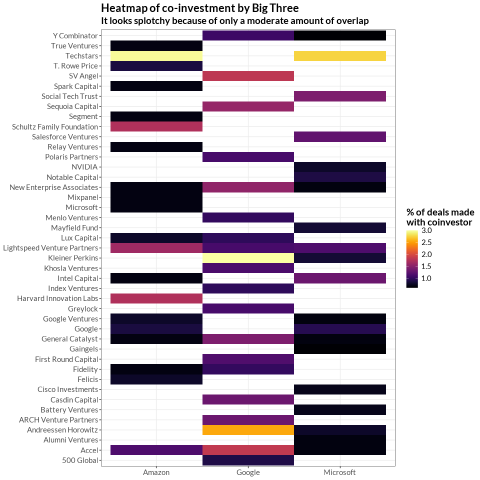
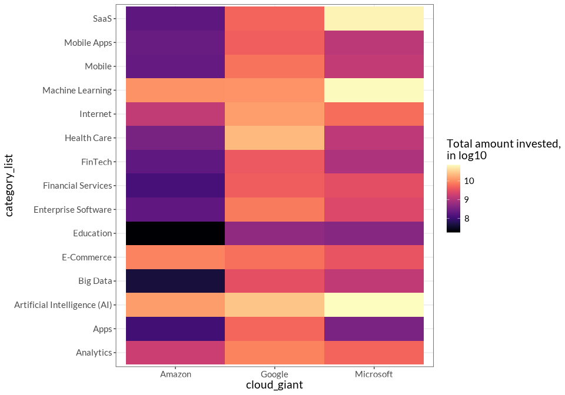
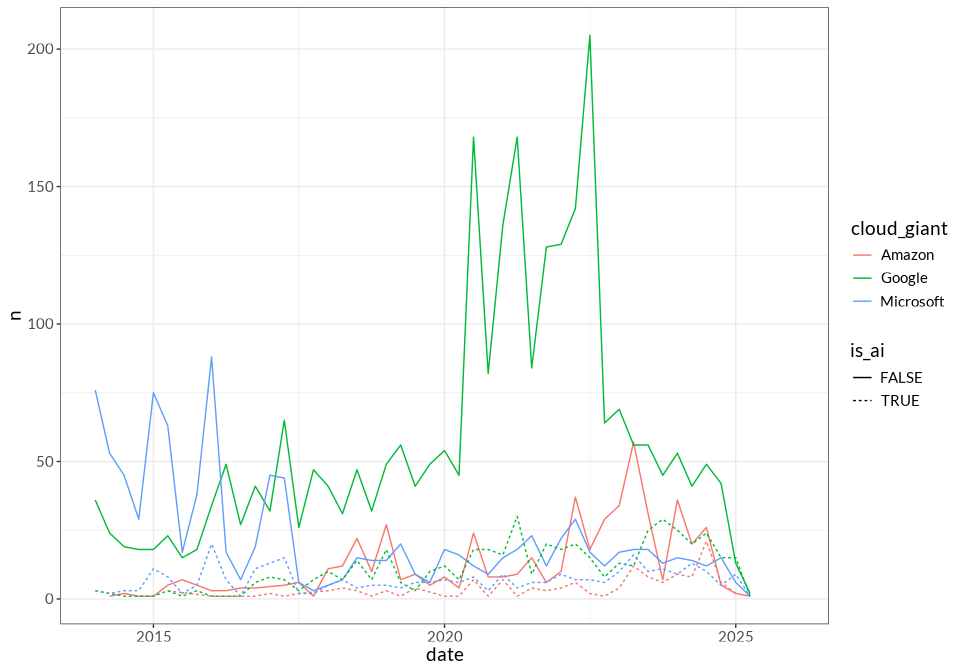
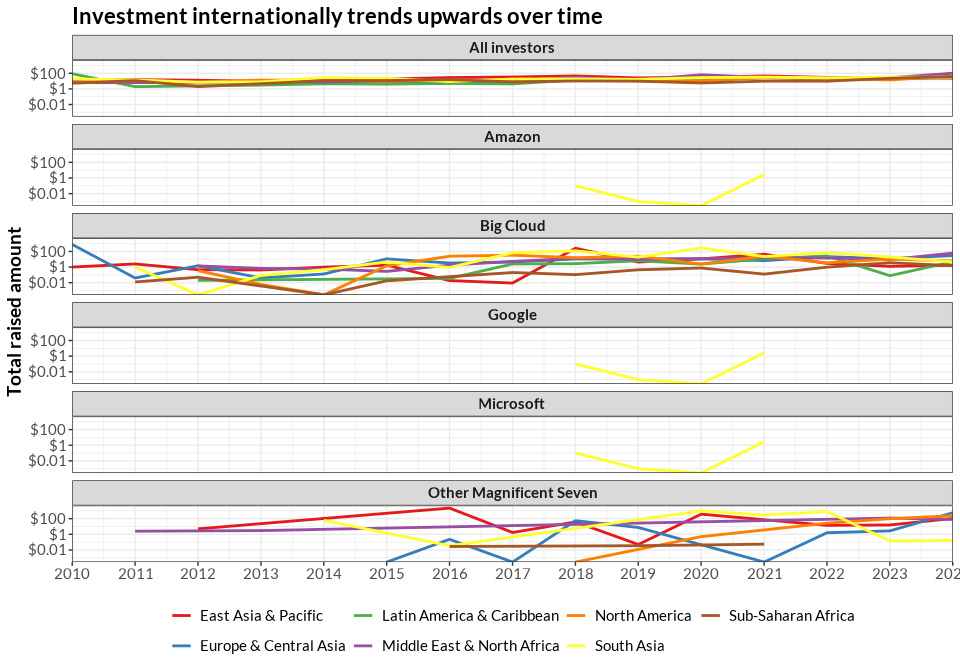

startup investments
================
2025-05-18

- [At a glance](#at-a-glance)
  - [Aliases](#aliases)
  - [Summary stats](#summary-stats)
  - [Important investors to compare
    against](#important-investors-to-compare-against)
  - [Comparing FAANG Open source and AI
    investments](#comparing-faang-open-source-and-ai-investments)
  - [Largest investments](#largest-investments)
- [Co-investment](#co-investment)
  - [Investment partners](#investment-partners)
  - [When does the Big Cloud invest in the same
    companies?](#when-does-the-big-cloud-invest-in-the-same-companies)
- [Sectoral analysis](#sectoral-analysis)
  - [Sectors at a glance](#sectors-at-a-glance)
  - [Popular sectors over time](#popular-sectors-over-time)
  - [AI vs Non-AI](#ai-vs-non-ai)
  - [Cloud vs Non-Cloud](#cloud-vs-non-cloud)
- [Demonstrating Cloud Dependence](#demonstrating-cloud-dependence)
  - [Compared to other companies, Big Cloud invests more times in the
    same
    company](#compared-to-other-companies-big-cloud-invests-more-times-in-the-same-company)
  - [Big Cloud acts as the lead investor in a disproportionate amount of
    cases](#big-cloud-acts-as-the-lead-investor-in-a-disproportionate-amount-of-cases)
  - [“Ouroboros” of Cloud](#ouroboros-of-cloud)
  - [Dependence of investment receivers on Big
    Cloud](#dependence-of-investment-receivers-on-big-cloud)
  - [Lead/ secondary: Can we quantify/ describe the difference in target
    firm when Big Cloud Lead investor vs secondary
    investor?](#lead-secondary-can-we-quantify-describe-the-difference-in-target-firm-when-big-cloud-lead-investor-vs-secondary-investor)
- [Changes over time](#changes-over-time)
- [Depending on kind of funding round? Can we test if VC deals are diff
  than others? Or if amounts are generally bigger when the Big Three
  invest or
  lead?](#depending-on-kind-of-funding-round-can-we-test-if-vc-deals-are-diff-than-others-or-if-amounts-are-generally-bigger-when-the-big-three-invest-or-lead)
- [International and “Third world”
  development](#international-and-third-world-development)

# At a glance

## Aliases

| Cloud corp | Aliases (# deals) |
|:---|:---|
| Amazon | AWS EdStart (1) , AWS Investments LLC (1) , Amazon Australia (1) , Amazon Housing Equity Fund (1) , Amazon One Medical (1) , Georg Hesse (Ex-Amazon Music) (1) , AWS Fintech Accelerator (2) , Amazon AWS Incubator (2) , Amazon.com NV Investment Holdings (2) , Banco da Amazonia (2) , Amazon Future Engineer (3) , AWS Double Equity (4) , Amazon.com.incs Ltd (4) , Amazon Launchpad (5) , AWS Activate (11) , Amazon Corporate Holdings (11) , Amazon Smbhav Venture Fund (11) , Austria Wirtschaftsservice (AWS) (12) , Amazon Industrial Innovation Fund (14) , Amazon Business (15) , AWS Foundation (17) , AWS Healthcare Accelerator (23) , AWS Startup Loft Accelerator (23) , AWS FinTech Africa Accelerator (25) , AWS Space Accelerator (37) , AWS Impact Accelerator (63) , Amazon Alexa Fund (140) , Amazon Web Services (148) , Amazon (158) |
| Google | Google AI (1) , Google Quantum AI (1) , Google for Startups Israel (1) , Google Canada (2) , Google Umbono (2) , Google’s Africa Investment Fund (2) , Google for Startups Women Founders Fund (7) , NCAIR-Google AI Fund (10) , Google Digital News Initiative (11) , Google for Startups Accelerator Canada (11) , Google Assistant Investments (21) , Google for Startups Latino Founders Fund (24) , Google Cloud (26) , Alphabet (27) , Google.org (85) , Google Launchpad Accelerator (117) , Google (313) , Google Ventures (1178) , Google for Startups (1654) |
| Microsoft | Microsoft Airband (1) , Microsoft Imagine Fund (1) , Microsoft Research (1) , Microsoft Founders Hub (2) , Azure (4) , Microsoft AI for Good Accelerator (13) , Microsoft Accelerator Shanghai (14) , Microsoft Accelerator Berlin (41) , Microsoft Accelerator Seattle (43) , Microsoft Climate Innovation Fund (51) , Microsoft Accelerator London (71) , Microsoft Accelerator Paris (72) , Microsoft ScaleUp Tel Aviv (109) , Microsoft Accelerator Bangalore (125) , Microsoft for Startups (126) , Microsoft (302) , M12 - Microsoft’s Venture Fund (317) , Microsoft Accelerator (387) |

## Summary stats

| Statistic                                 |   Value |
|:------------------------------------------|--------:|
| \# of investments                         | 1174990 |
| \# of unique funding rounds               |  711238 |
| \# of investors                           |  300934 |
| \# of companies receiving investment      | 3862971 |
| Median investors in a given funding round |       1 |

Top-level summary statistics of full dataset

## Important investors to compare against

| name                        | criteria           | investment_count |
|:----------------------------|:-------------------|-----------------:|
| Y Combinator                | Active Accelerator |             7323 |
| Techstars                   | Active Accelerator |             6205 |
| MassChallenge               | Active Accelerator |             3200 |
| 500 Global                  | Active Accelerator |             3174 |
| SOSV                        | Active Accelerator |             2881 |
| Plug and Play               | Active Accelerator |             1975 |
| Google for Startups         | Active Accelerator |             1654 |
| Newchip Accelerator         | Active Accelerator |             1285 |
| VentureOut                  | Active Accelerator |             1093 |
| Cleantech Open              | Active Accelerator |              679 |
| Accel                       | Big VC             |             2173 |
| Sequoia Capital             | Big VC             |             2122 |
| Insight Partners            | Big VC             |             1136 |
| New Enterprise Associates   | Big VC             |             2232 |
| General Catalyst            | Big VC             |             1445 |
| Andreessen Horowitz         | Big VC             |             1673 |
| Tiger Global Management     | Big VC             |             1206 |
| Greenspring Associates      | Big VC             |              217 |
| Thrive Capital              | Big VC             |              361 |
| Lightspeed Venture Partners | Big VC             |             1485 |
| Meta                        | Other FAANG        |               59 |
| Apple                       | Other FAANG        |               32 |
| NVIDIA                      | Other FAANG        |              122 |

The table below is a bit messy conceptually because it’s processing the
same funding round multiple times often.

| Statistic | Active Accelerator | All investments | Amazon | Big VC | Google | Microsoft | Other FAANG |
|:---|:---|:---|:---|:---|:---|:---|:---|
| Total number of deals | 29,469 | 1,174,990 | 738 | 14,050 | 3,493 | 1,680 | 213 |
| Total dollar amount of participated deals (in millions, including other investors) | 57,556.74 | 30,289,750.83 | 33,075.15 | 976,020.49 | 114,936.91 | 98,160.22 | 54,055.37 |
| Number of investing aliases | 10 | 155,581 | 29 | 10 | 19 | 18 | 3 |
| % of time that they “lead” funding rounds | 38.27 | 29.04 | 68.43 | 42.35 | 69.37 | 54.35 | 33.33 |
| % of time that they are the sole investor | 56.68 | 28.62 | 53.79 | 8.83 | 57.97 | 57.38 | 33.8 |
| % of companies receiving repeat investments | 17.78 | 20.89 | 8.06 | 43.53 | 13.63 | 11.51 | 10.93 |
| Median size of participating deal | 0.33 | 4.84 | 2.27 | 21.4 | 6.5 | 11 | 26.75 |
| Companies receiving investment | 22,419 | 294,632 | 633 | 6,859 | 2,854 | 1,260 | 183 |
| % of invested companies in open-source | 0.51 | 0.22 | 0.95 | 1.4 | 0.49 | 0.48 | 2.19 |
| % of invested companies in AI | 13.5 | 6.67 | 19.59 | 12.12 | 14.26 | 19.37 | 44.26 |
| % of invested companies in Crypto | 1.03 | 1.2 | 1.42 | 2.33 | 0.77 | 0.87 | 2.19 |

Summary statistics by corp group

## Comparing FAANG Open source and AI investments

    ## # A tibble: 6 × 3
    ##   cloud_giant    os    ai
    ##   <chr>       <dbl> <dbl>
    ## 1 Amazon       0.95  19.6
    ## 2 Apple        0     13.8
    ## 3 Google       0.49  14.3
    ## 4 Meta         0     22.2
    ## 5 Microsoft    0.48  19.4
    ## 6 NVIDIA       3.92  65.7

## Largest investments

These are outliers, generally –

| name | announced_on | Raised amount, millions |
|:---|:---|:---|
| Microsoft investment in Venture Round - OpenAI | 2025-03-31 | 40,000 |
| Microsoft investment in Corporate Round - OpenAI | 2023-01-10 | 10,000 |
| Microsoft investment in Venture Round - OpenAI | 2024-10-02 | 6,600 |
| Alphabet investment in Series C - Waymo | 2024-07-23 | 5,600 |
| Google investment in Corporate Round - Reliance Jio | 2020-07-15 | 4,489.24 |
| Amazon investment in Convertible Note - Anthropic | 2023-09-25 | 4,000 |
| Amazon investment in Corporate Round - Anthropic | 2024-11-22 | 4,000 |
| Google investment in Post-IPO Equity - Clearwire | 2008-05-06 | 3,200 |
| Amazon investment in Series E - Rivian | 2020-07-10 | 2,500 |
| Alphabet investment in Series B - Waymo | 2021-06-16 | 2,500 |
| Alphabet investment in Series A - Waymo | 2020-03-02 | 2,250 |
| Microsoft investment in Corporate Round - Cruise | 2021-01-19 | 2,000 |
| Microsoft investment in Post-IPO Secondary - London Stock Exchange Group | 2022-12-11 | 2,000 |
| Google investment in Corporate Round - Anthropic | 2023-10-27 | 2,000 |
| Google investment in Series B - Commonwealth Fusion | 2021-12-01 | 1,800 |
| Amazon investment in Corporate Round - Amazon Seller Services | 2020-09-30 | 1,526.48 |
| Amazon Corporate Holdings investment in Corporate Round - Amazon Seller Services | 2020-09-30 | 1,526.48 |
| Google investment in Series E - Gojek | 2018-02-12 | 1,500 |
| Google investment in Post-IPO Equity - ADT | 2022-09-06 | 1,500 |
| Microsoft investment in Corporate Round - G42 | 2024-04-15 | 1,500 |

# Co-investment

## Investment partners

Who are the cloud companies most often partnering with?

For first pass, plucked out top 20 co-investors for each of the big
three. Table below has 43 rows because of the overlaps. Honestly not
that informative or shocking –

- coinvestors are pretty spread out, there are some repeated partners
  but big three mostly invest by themselves and not with a single
  investment partner
- And they share *some* partners but not a ton – maybe that can be
  exploited to show theyre investing in different things
- Google invests sometimes with MSFT and Amazon, but not a whole lot?

| name                        | Amazon     | Google     | Microsoft  |
|:----------------------------|:-----------|:-----------|:-----------|
| Techstars                   | 31 (2.97%) |            | 50 (2.75%) |
| Harvard Innovation Labs     | 18 (1.73%) |            |            |
| Schultz Family Foundation   | 18 (1.73%) |            |            |
| Lightspeed Venture Partners | 17 (1.63%) | 41 (1.11%) | 21 (1.15%) |
| Accel                       | 12 (1.15%) | 68 (1.84%) | 12 (0.66%) |
| Google                      | 9 (0.86%)  |            | 17 (0.93%) |
| T. Rowe Price               | 9 (0.86%)  |            |            |
| Google Ventures             | 8 (0.77%)  |            | 12 (0.66%) |
| Felicis                     | 8 (0.77%)  |            |            |
| Lux Capital                 | 8 (0.77%)  | 36 (0.97%) |            |
| Spark Capital               | 7 (0.67%)  |            |            |
| General Catalyst            | 7 (0.67%)  | 53 (1.43%) | 12 (0.66%) |
| New Enterprise Associates   | 7 (0.67%)  | 57 (1.54%) | 12 (0.66%) |
| Mixpanel                    | 7 (0.67%)  |            |            |
| Segment                     | 7 (0.67%)  |            |            |
| Relay Ventures              | 7 (0.67%)  |            |            |
| True Ventures               | 7 (0.67%)  |            |            |
| Intel Capital               | 7 (0.67%)  |            | 24 (1.32%) |
| Fidelity                    | 7 (0.67%)  | 37 (1%)    |            |
| Microsoft                   | 7 (0.67%)  |            |            |
| Kleiner Perkins             |            | 111 (3%)   | 15 (0.82%) |
| Andreessen Horowitz         |            | 94 (2.54%) | 14 (0.77%) |
| SV Angel                    |            | 67 (1.81%) |            |
| Sequoia Capital             |            | 58 (1.57%) |            |
| Casdin Capital              |            | 49 (1.32%) |            |
| ARCH Venture Partners       |            | 49 (1.32%) |            |
| First Round Capital         |            | 43 (1.16%) |            |
| Khosla Ventures             |            | 42 (1.13%) |            |
| Polaris Partners            |            | 41 (1.11%) |            |
| Greylock                    |            | 41 (1.11%) |            |
| Y Combinator                |            | 39 (1.05%) | 11 (0.6%)  |
| Menlo Ventures              |            | 37 (1%)    |            |
| Index Ventures              |            | 36 (0.97%) |            |
| 500 Global                  |            | 33 (0.89%) |            |
| Social Tech Trust           |            |            | 26 (1.43%) |
| Salesforce Ventures         |            |            | 23 (1.26%) |
| Notable Capital             |            |            | 16 (0.88%) |
| Mayfield Fund               |            |            | 15 (0.82%) |
| NVIDIA                      |            |            | 14 (0.77%) |
| Cisco Investments           |            |            | 13 (0.71%) |
| Battery Ventures            |            |            | 13 (0.71%) |
| Alumni Ventures             |            |            | 12 (0.66%) |
| Gaingels                    |            |            | 11 (0.6%)  |

<!-- -->

## When does the Big Cloud invest in the same companies?

# Sectoral analysis

## Sectors at a glance

    ## # A tibble: 15 × 4
    ##    category_list                Amazon              Google             Microsoft
    ##    <chr>                        <chr>               <chr>              <chr>    
    ##  1 Analytics                    33 ($ 1,746.69498)  226 ($ 8,531.2344) 170 ($ 4…
    ##  2 Apps                         29 ($   107.70035)  218 ($ 5,133.2495) 95 ($   …
    ##  3 Artificial Intelligence (AI) 144 ($13,384.16716) 505 ($26,844.9735) 334 ($72…
    ##  4 Big Data                     12 ($    45.03736)  124 ($ 3,042.6298) 101 ($  …
    ##  5 E-Commerce                   81 ($ 8,504.17703)  261 ($ 6,146.6313) 110 ($ 3…
    ##  6 Education                    46 ($    18.14265)  207 ($   539.5331) 62 ($   …
    ##  7 Enterprise Software          12 ($   200.30649)  196 ($ 7,417.6111) 165 ($ 2…
    ##  8 FinTech                      52 ($   191.68362)  240 ($ 3,914.0415) 57 ($   …
    ##  9 Financial Services           44 ($   119.22662)  257 ($ 4,249.8737) 69 ($ 2,…
    ## 10 Health Care                  61 ($   326.64245)  536 ($21,576.2998) 117 ($ 1…
    ## 11 Internet                     65 ($ 1,445.43766)  249 ($13,538.3654) 151 ($  …
    ## 12 Machine Learning             53 ($11,033.18599)  279 ($11,105.6994) 213 ($68…
    ## 13 Mobile                       18 ($    218.0029)  167 ($ 6,428.5373) 132 ($ 1…
    ## 14 Mobile Apps                  19 ($   237.60764)  183 ($  4,408.834) 62 ($ 1,…
    ## 15 SaaS                         51 ($   190.38002)  344 ($ 5,041.7372) 257 ($60…

<!-- -->

<!-- -->

## Popular sectors over time

<!-- -->

<!-- -->
\## When are cloud companies releasing “free” / open source to build
their market?

## AI vs Non-AI

By \# of deals:

<!-- -->

<!-- -->

<!-- -->
\## GovTech

What kind of govtech firms to Big Cloud invest in?

## Cloud vs Non-Cloud

Compare cloud companies investment strategies to “non-cloud” tech, eg
Meta/Apple, or edge, eg Intel

# Demonstrating Cloud Dependence

## Compared to other companies, Big Cloud invests more times in the same company

## Big Cloud acts as the lead investor in a disproportionate amount of cases

## “Ouroboros” of Cloud

When is Big Cloud are investing in other companies that do cloud infra
(Kubernetes)?

## Dependence of investment receivers on Big Cloud

Can we measure when one Big Cloud co has invested a large amount of
company’s investment total?

(how can we operationalize this given the dataset? Similar to
lead/secondary question?)

## Lead/ secondary: Can we quantify/ describe the difference in target firm when Big Cloud Lead investor vs secondary investor?

# Changes over time

When does Amazon become a cloud company? What about the others? Is there
some “natural” progression? What external data will we need?

# Depending on kind of funding round? Can we test if VC deals are diff than others? Or if amounts are generally bigger when the Big Three invest or lead?

# International and “Third world” development

Would probably be code to incorporate an “all EU” designation if we can
get an easy list of the country codes. Each company receiving investment
is listed once per cloud giant in the table below, so if Google invested
in Asian Company LLC 3 times it’d still only appear once.

| country_code                   | Amazon       | Google        | Microsoft    |
|:-------------------------------|:-------------|:--------------|:-------------|
| USA                            | 350 (55.29%) | 1326 (46.46%) | 513 (40.71%) |
| IND                            | 68 (10.74%)  | 167 (5.85%)   | 126 (10%)    |
| GBR                            | 38 (6%)      | 180 (6.31%)   | 141 (11.19%) |
| ISR                            | 19 (3%)      | NA            | 124 (9.84%)  |
| AUS                            | 16 (2.53%)   | NA            | NA           |
| CAN                            | 16 (2.53%)   | 52 (1.82%)    | 36 (2.86%)   |
| AUT                            | 15 (2.37%)   | NA            | NA           |
| BRA                            | 14 (2.21%)   | 263 (9.22%)   | NA           |
| NGA                            | 12 (1.9%)    | 83 (2.91%)    | NA           |
| NA                             | 10 (1.58%)   | NA            | 19 (1.51%)   |
| All others for this cloud corp | 96 (15.17%)  | 497 (17.41%)  | 165 (13.1%)  |
| ESP                            | NA           | 82 (2.87%)    | NA           |
| DEU                            | NA           | 78 (2.73%)    | 51 (4.05%)   |
| JPN                            | NA           | 71 (2.49%)    | NA           |
| POL                            | NA           | 62 (2.17%)    | NA           |
| KOR                            | NA           | 52 (1.82%)    | NA           |
| CHN                            | NA           | NA            | 157 (12.46%) |
| FRA                            | NA           | NA            | 84 (6.67%)   |
| SGP                            | NA           | NA            | 13 (1.03%)   |

Summary statistics by cloud corp

There seems to be Third World development / investment arms maintained
by the big 3 cloud:

- <https://www.crunchbase.com/organization/umbono>
- Google’s Africa Investment Fund investment in Series C - Moniepoin
- NCAIR-Google AI Fund: Nigeria investments
- Alibaba?
